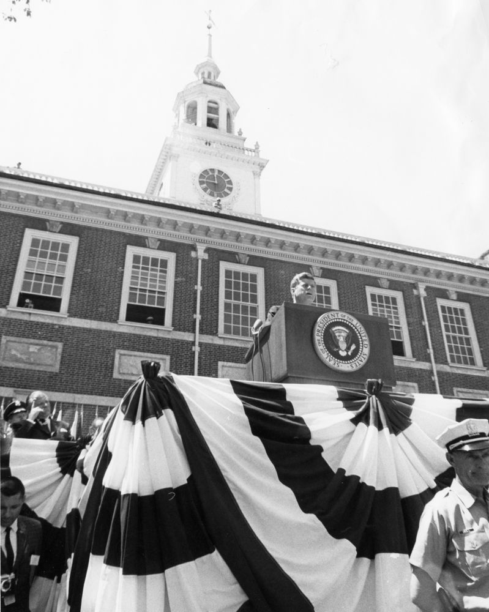
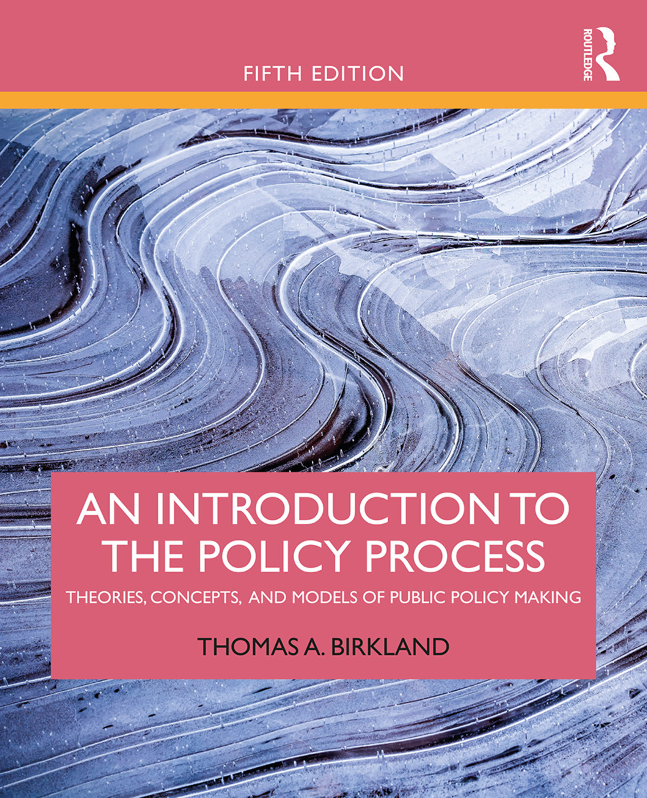
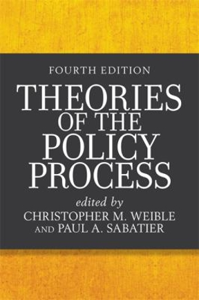
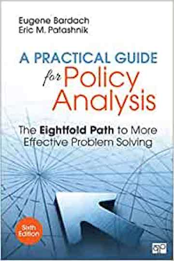
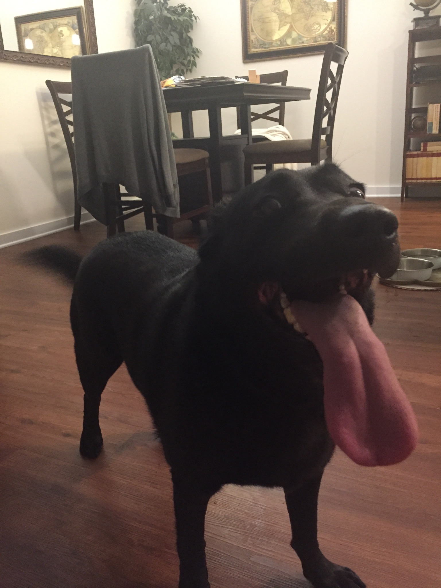

  
```{r setup, include=FALSE}
knitr::opts_chunk$set(warning = FALSE, message = FALSE, 
                      fig.retina = 3, fig.align = "center")
```

```{r xaringanExtra, echo=FALSE}
xaringanExtra::use_webcam()
```

.pull-left[
# Syllabus <br>Overview

<figure>
  
</figure>
]

.pull-right[

</br>
</br>
</br>
**EVSS-PUBA: Public Policy**

**Fall 2021**

.light[Matthew Nowlin, PhD<br>
Department of Political Science<br>
College of Charleston
]

]

---

class: title title-1

# COVID-19 

.pull-left[
**It's not over** 

**Get vaccinated!**

**Masks must be worn in class at all times** 

**If you don't feel well, don't come to class**

**If you have been exposed to COVID-19, don't come to class** 
]

.pull-right[
</br>
<figure>
  
</figure>
]

---

class: center, middle

# Syllabus Stuff

---

class: title title-1

# The Syllabus 

**It's on OAKS (lms.cofc.edu)** 

**Content -> Course Information -> Syllabus** 

**Provides an overview of the course and includes required materials and assignments** 

**Readings and due dates may change**

**Be patient and be flexible** 

---

class: title title-1

# Your Professor 

.pull-left[
<figure>
  
</figure>
]

.pull-right[
- Dr. Matthew C. Nowlin 

- Email: [nowlinmc@cofc.edu](mailto:nowlinmc@cofc.edu)

- ~~Office~~ Student hours (Zoom only): Use the [Calendly link](https://calendly.com/nowlinmc/meetings) on the syllabus and on OAKS  

- **Environmental Policy Research Group** 
]


---

class: title title-1

# What is this course about? 

.pull-left[

</br>


> Our responsibility is one of decision --- for to govern is to choose 

> -- John F. Kennedy
]


.pull-right[
<figure>
<center>
  
</figure>
]

---

class: title title-1

# What is this course about? 

**As stated by President Kennedy, making choices is at the heart of governing. How do policymakers make choices regarding public policy? This course will address this question by examining the policymaking process in the United States.** 

---

class: title title-1

# What is this course about? 

**The course is divided into three sections**: 

1) **Foundations**: includes some of the foundational aspects of policymaking in the US such as democracy, equality, institutions, and actors

--

2) **Theories of the Policy Process**: covers the major policy process theories that scholars have developed

--

3) **Applied Policy Research**: discusses how knowledge is applied to address pressing societal problems and includes policy design, implementation, analysis, and evaluation. 


---

class: title title-1

# Course Goals and Learning Objectives

-  Explain the various policy process theories and frameworks

-  Apply one or more of the policy process theories to a policy problem

-  Analyze policy problems and their potential solutions 

-  Develop a detailed understanding of a policy problem or issue

-  Display oral, written, and group communication skills

.tiny[**NASPAA**: Students who graduate from NASPAA accredited MPA programs should develop the ability to: **participate in and contribute to the policy process**.]

---

class: title title-1

# Learning 

* This course will be _lecture_ and _discussion_ based 

--

* Do assigned readings prior to class

--

* Be prepared to participate in class

--

* I may call on you to answer a question or discuss your policy issue 

--

* Laptops are allowed, but (not strongly) discouraged 

--

* Phones should silent and put away during class 

---

class: title title-1

# Required Books

.pull-left-3[
<center>
<figure>
  
</figure>
]

.pull-middle-3[
<figure>
  
</figure>
]

.pull-left-3[
<figure>
  
</figure>
]


---

class: title title-1

# Course Requirements and Grading

Assignment | Possible Points
--- | ---
**Reflection Papers** (10 at 20 points each) |  200 points total 
**Policy Report Draft Sections** (4 at 50 points each) | 200 points total  
**Policy Report** | 100 points 
**Decision Memo** | 75 points
**Course Reflection Essay** | 25 points 
**Engagement** |  100 points 
 | 
**Total** | **700 points** 

---

class: center, middle

# Keep a copy of your work! 

---

class: title title-1

# Assignments 

* _Reflection Papers_: You will write 10 short, about 2 pages, reflection papers that summarize and integrate the readings. Prompts will be given for each paper in [OAKS](https://lms.cofc.edu). Note that 12 are assigned, but only 10 will be graded. **When assigned, reflection papers are due at class time.** 

--

* _Policy Report_: You will write a 10-12 page policy report. For the policy report you will define a problem; explore the policy history and policy mapping of the problem; consider three alternatives to address the problem; evaluate those alternatives; and make a recommendation.

---

class: title title-1

# Assignments 

* _Policy Report Draft Sections_: You will turn in drafts of parts of the policy report throughout the semester. Instructions for the report and each part of the report is on [OAKS](https://lms.cofc.edu). 
	
  * **Part 1 draft DUE: Sept 20**
  * **Part 2 draft DUE: Sept 27**
	* **Part 3 draft DUE: Nov 22**
	* **Part 4 draft DUE: Nov 29**
	* **Final policy report DUE: Dec 10**
	
---

class: title title-1

# Assignments 

* _Decision Memo_: The decision memo is based on your policy report, and will be a two-page memo where you clearly distill for a decision-maker what you have learned and would recommend regarding your policy issue. **The decision memo is due December 10.**

--

* *Course Reflection Paper*: The course reflection paper will be a 1 to 2 page paper that will ask you guided questions so you can reflect on how well we met the course objectives. **The course reflection paper is due December 6.** 

---

class: title title-1

# Assignments 

* _Course Engagement_: Students are expected to participate in the course by asking questions, providing thoughtful comments, and through making contributions to the group discussion portion of class. **Class discussion should be better than it would have been had you not attended.** 

--

Attendance will be taken for each class session, and will be part of your course engagement grade. You are allowed to miss _one class without penalty_.  **However, do not come to class if you feel ill. Additionally, if you have been exposed to or tested positive for COVID-19, do not come to class regardless of how you feel.** 

---

class: title title-1

# A Note on Feedback 

Each of your reflection papers will be graded in a holistic fashion. I will examine and grade the document as whole, I am therefore not likely to make specific comments on multiple aspects of each of your papers. 

* Feedback on your draft policy report sections will be geared toward the final policy report 

* I am happy to meet with you (on Zoom) to be provide feedback on any assignments or your writing as a whole

---

class: title title-1

# Late Work Policy 

Late work is subject to a 48-hour grace period, and after that will be penalized 10% each day (24 hr period) it is late, up to 3 days. After 3 days the assignment will not be accepted.

---

class: title title-1

# Important Information 

**Make note of:** 

* **Honor Code and Academic Integrity** 
* **Students with Disabilities** 
* **Financial Challenges** 
* **Counseling Center** 
* **Center for Student Learning**
* **Religious Holiday Policy** 
* **Weather**

---

class: center, middle

# Introduce yourself! 

---

class: title title-1

# Introductions 

* Your name 

* Your pronouns 

* Your program (MES, MPA, Concurrent)

* Your professional interests

---

class: title title-1

# Introductions  

.pull-left[
<center>
<figure>
  
</figure>
]

.pull-right[
**Name**: Lincoln Nowlin 

**Pronouns**: He/him/his

**Program**: concurrent, Master of Licking (ML) and Master of Sniffing (MS)

**Professional interests**: being a very good boy 
]

