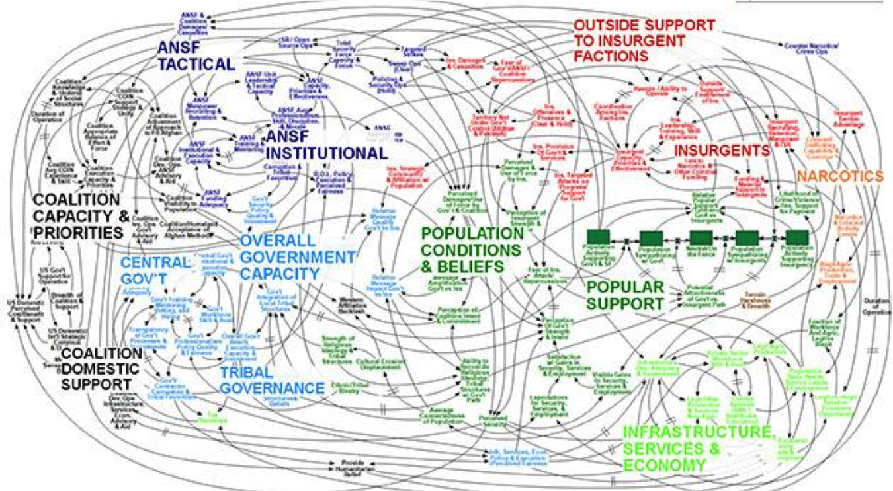
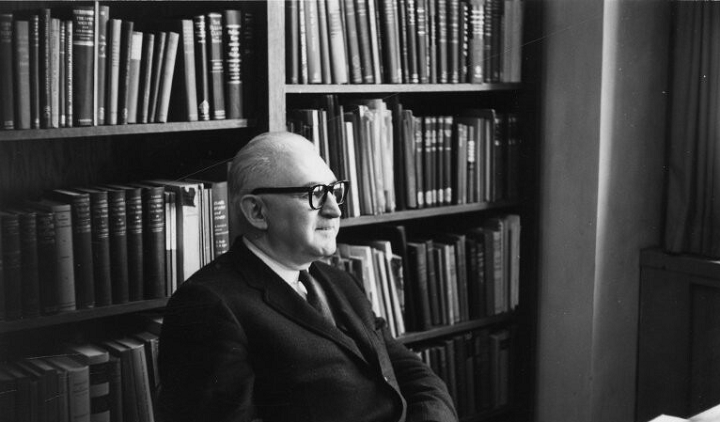

  
```{r setup, include=FALSE}
knitr::opts_chunk$set(warning = FALSE, message = FALSE, 
                      fig.retina = 3, fig.align = "center")
```

```{r xaringanExtra, echo=FALSE}
xaringanExtra::use_webcam()
```

.pull-left[
# An Introduction to the Study of Public Policy
<figure>
  
</figure>
]

.pull-right[

</br>
</br>
</br>
**EVSS-PUBA: Public Policy**

**Fall 2021**

.light[Matthew Nowlin, PhD<br>
Department of Political Science<br>
College of Charleston
]

]

---

class: center, middle

# What is the biggest _problem_ facing the United States? 

---

class: title title-1

# Problems 

**What makes something a "problem"?** 

--

_What private troubles warrant definition as public problems and thereby legitimately raise claims for remedy with public resources?_ 

--

**Problems vs. Conditions** 

--

**Problems**: something can be done to address it 

--

**Conditions**: nothing can be done to address it; _it's just the way it is_ 

---

class: center, middle

# How do we address problems? 

???
policy

---

class: center, middle

# What is public policy and how do we study it?

---

class: title title-1

# Complexity 

**"Afghanistan Stability/COIN Dynamics – Security"**

<center>


???
_When we understand that slide, we'll have won the war_ 

-General Stanley McChrystal 

---

class: center, middle

# How do we understand something so complex? 

???
first we have to define the concept of public policy 

---

class: title title-1

# What is public policy?

--

**Cairney: the sum total of government action, from signals of intent to the final outcomes**

--

* Does ‘government action’ include what policymakers say they will do as well as what they actually do?

--

* Does it include the effects of a decision as well as the decision itself? 

--

* What is ‘the government’ and does it include elected and unelected policymakers?

--

* Does public policy include what policymakers do _not_ do?  

---

class: title title-1

# What is public policy?

* Policy responds to a _problem_ 

--

* The policy is made on the "public’s" behalf

--

* Policies have goals 

--

* Policies are made by governments

--

* Policies are implemented by public and private actors

--

* Policy can be action or _inaction_ 

--

* Policy allocates values 


???
characteristics of public policy; various definitions contain these elements 

---

class: center, middle

# OK, but how do we study this? 

---

class: title title-1

# Studying public policy 

**Harold Laswell and the Policy Sciences** 

.pull-left[
<figure>
  
</figure>
]

.pull-right[

* Knowledge *of* the policy process
    * How policy is made 

* Knowledge *in* the policy process
    * Policy analysis 
    * Policy evaluation 
]


---

class: title title-1

# Knowledge OF and knowledge IN   

**Knowledge OF**
* The how and why of policymaking

* Why governments pay attention to some problems and not others

* Why policy changes (or remains stable)

* How individuals and groups affect policy

---

class: title title-1

# Knowledge OF and knowledge IN   

** Knowledge IN**
* Policy analysis
    * _what should we do_?
    * statistical methods and economic models 

--

* Policy evaluation
    * _what have we done_?
    * casual relationship between the policy and the outcome


---

class: title title-1

# For Next Time 

**Democracy and the Policy Sciences** 

* _Readings_: 
	* Dahl, Robert A., Chap 4, _What is Democracy?_ 
	* Dahl, Robert A., Chap 5, _Why Democracy?_
	* Levitsky and Ziblatt, Chapter 1: _How Democracies Die: Introduction_
	* **SKIM**: Smith and Larimer, Chap 1 _Public Policy as a Concept and a Field (or Fields) of Study_ (**pgs. 7-15**) 
	* **SKIM**: deLeon, Peter. 1995. "Democratic Values and the Policy Sciences." *American Journal of Political Science* 39(4): 886–905.

---

class: title title-1

# For Next Time 

**Democracy and the Policy Sciences** 

* _Supplemental Materials_: 
	* [How Democracies Die - Interview with Harvard Professor Steven Levitsky](https://youtu.be/EdB1zr1GplA)

* _Assignments_: 
	* **Reflection paper 1** 


