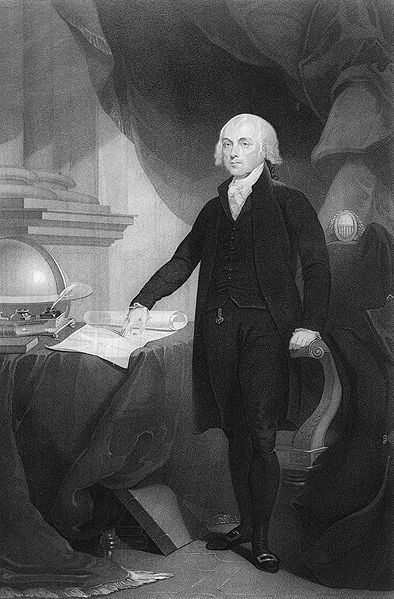
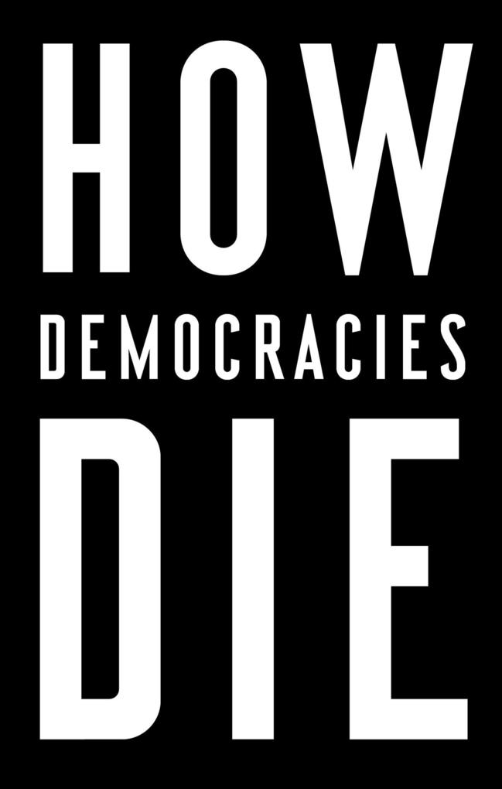
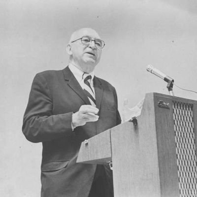

  
```{r setup, include=FALSE}
knitr::opts_chunk$set(warning = FALSE, message = FALSE, 
                      fig.retina = 3, fig.align = "center")
```

```{r xaringanExtra, echo=FALSE}
xaringanExtra::use_webcam()
```

.pull-left[
# Democracy and the Policy Sciences
<figure>
  
</figure>
]

.pull-right[

</br>
</br>
</br>
**EVSS-PUBA 602: Public Policy**

**Fall 2021**

.light[Matthew Nowlin, PhD<br>
Department of Political Science<br>
College of Charleston
]

]

---

class: title title-1

# Public Policy

</br> 

## A statement by government of what it intends to do, such as a law, regulation, ruling, decision, order; or a combination of these. The lack of such statements may also be an implicit statement of a policy not to do something 

-*Birkland*, pg 6

???
* Policy responds to a _problem_ 
* The policy is made on the "public’s" behalf
* Policies have goals 
* Policies are made by governments
* Policies are implemented by public and private actors
* Policy can be action or _inaction_ 
* Policy allocates values 


---

class: center, middle

# What system of government do we have? 

???
short answer: democracy, but ...

---


class: title title-1

# Democracy

**Is the US a Republic or a Democracy?**

--

**Madison in Federalist 10** 

.pull-left[
**a pure democracy**: small number of citizens ... adminster government in person

**a republic**: a government in which the scheme of representation takes place
]


.pull-right[
<figure>
<center>
  
</figure>
]

???
note that this info comes from Hans Noel lecture 

claiming that the US is a republic is often used as a way to discourage reforms to make the system more democratic 

---

class: title title-1

# Democracy

**Is the US a Republic or a Democracy?** 

**Republic**: Latin - _res_ (entity, concern) + _publicus_ ('of the people', public )
* No monarch; Authority from the people 

--

**Democracy**: Greek - _demos_ ('the people') + _kratia_ (power, rule)
* The people rule  


???
kratia - kray-sha

---

class: title title-1

# Democracy

**Is the US a Republic or a Democracy?** 

**Constitutional**: Constrained by agreed-upon rules 

--

**Representative**: Made up of delegates and trustees 


--

**But...** 

.pull-left[
How is authority arranged? 

How do the people rule? When? 
]

.pull-right[
What type of constraints? Who chooses?

How are representatives selected? 
]

---

class: title title-1

# Democracy 

|**Republic and Democracy**|
| :---: | 

 |  | **Democracy** | **Not a Democracy** | 
 | :---           | :---                 |
|**Republic** | The United States | People's Republic of China 
| | South Korea  | North Korea 
| | Germany | Cuba
| | | |
| **Not a Republic** | The United Kingdom | Saudi Arabia
| | Canada | Oman
| | Australia | Qatar 

---

class: title title-1

# What is Democracy? 

_A system of government with regular, free and fair elections, in which all adult citizens have the right to vote and possess basic civil liberties such as freedom of speech and association_ 

.footnote[-_Levitsky_ and _Ziblatt_, pg. 6]

---

class: title title-1

# What is Democracy? 


**One _elementary principle_ of democracy** 

_That all members [of a polity] are to be treated (under the constitution) as if they were equally qualified to participate in the process of making decisions about the policies [the polity] will pursue_


.footnote[-_Dahl_, pg. 37]

---

class: title title-1

# What is Democracy? 

**Criteria for a democratic process** 

--

* Effective participation 

* Equality in voting 

* Gaining enlightened understanding 

* Exercising final control over the agenda 

* Inclusion of adults 

???

Effective participation: all members must have _equal and effective opportunities_  to make their views known 

Equality in voting: all members must have an _equal and effective opportunity_ to vote and all votes must be counted as equal 

Gaining enlightened understanding: _equal and effective opportunities_  for learning about relevant alternative policies and their likely consequences 

Exercising final control over the agenda: members must have the exclusive opportunity to decide how and, if they choose, what matter will be placed on the agenda 

Inclusion of adults: all (or at least most) adult permanent residents should have the full rights of citizens that are implied by the first four criteria 

---

class: title title-1

# Why Democracy? 

**Democracy produces desirable consequences** 

--

.pull-left[
* Avoiding tyranny
* Essential rights
* General freedom 
* Self determination 
* Moral autonomy
]


--


.pull-right[
* Human development
* Protecting essential personal interests 
* Political equality 
* Peace-seeking
* Prosperity 
]

???
The issue is whether in the long run a democratic process is likely to do less harm to the fundamental rights and interests of its citizens than any nondemocratic alternative. (Dahl, pg 48)

---

class: title title-1

# Other Forms of Government 

**Socialism**: the means of production, distribution, and exchange should be owned or regulated by the community as a whole
* **Communism**: control by one central government 

--

**Fascism**: led by a dictator having complete power, forcibly suppressing opposition and criticism, regimenting all industry, commerce, etc., and emphasizing an aggressive nationalism and often racism
* **Autocratic**: a person has rules with unlimited authority 

---

class: title title-1

# Other Forms of Government 

**Authoritarian**: central government that maintains power through repression and exclusion of challengers
* _Authoritarian equilibrium rests mainly on lies, fear, and economic prosperity_ 

--

**Competitive Authoritarianism**: hold elections but ensure that they are fundamentally unfair


---

class: title title-1

# Democratic Backsliding 

.pull-left[
**Weakening of norms** 

**Mutual toleration**: competing parties accept one another as legitimate rivals

**Forbearance**: exercise restraint in deploying their institutional prerogatives 
] 

.pull-right[
<figure>
<center>
  
</figure>
]

---

class: center, middle

# Are you concerned about the health of democracy in the US? 

---

class: center, middle

# What are the _Policy Sciences_? 

---

class: title title-1 

# The Policy Sciences 

.pull-left[
<figure>
  
</figure>
]

.pull-right[
_The policy sciences includes 1) the methods by which the policy process is investigated, 2) the results of the study of policy, and 3) the findings of the disciplines making the most important contributions to the intelligence needs of the time_. 
.tiny[**Lasswell, _The Policy Orientation_ 1951, pg 4.**]
]

---

class: center, middle

# The policy sciences uses _social science methods_ to **understand** policymaking and to **inform** policymakers 

---

class: title title-1 

# Characteristics of the Policy Sciences 

**Problem oriented**  
  * Aimed at addressing societal problems 

--

**Multidisciplinary** 
  * Draws from all scientific disciplines 

--

**Methodologically sophisticated**  
  * How _quantitative_ methodology can be applied to address problems 
  
---

class: title title-1 

# Characteristics of the Policy Sciences 

**Theoretically sophisticated**  
  * Understand cause and effect 

--

**Value oriented**  
  * Policy sciences _of democracy_

--

_The special emphasis is on the policy sciences of democracy, in which the ultimate goal is the realization of human dignity in theory and fact_ 
.tiny[**Lasswell, 1951, 15**] 

---

class: center, middle 

# What role do you see for democracy in the Policy Sciences? 

---

class: middle 

# _Within the policy sciences themselves lurk dangerous elitist and technocratic tendencies towards decidedly undemocratic ends and means_ 

-**deLeon 1995, 888**

???
policy scientists as "p for the body politic" didn't work: failures such as vietnam, war on poverty, energy crisis 

---

class: title title-1

# Models of Democracy 

**Madisonian model**: control of factions; tyranny of a majority faction; external control of factions (e.g., separation of powers, representative democracy) 

--

**deTocqueville**: civil society; direct involvement of individuals in voluntary political and social organizations 

--

_Participatory policy analysis_: include lay citizens in technical policy deliberations 

---

class: title title-1

# For Next Time 

**Equality and Social Constructions**

* Dahl, Robert A., Chap 6, _Why Political Equality I? Intrinsic Equality_ 
* Dahl, Robert A., Chap 7, _Why Political Equality II? Civic Competence_ 
* powell, john a., Chap 1, _Post-Racialism or Targeted Universalism?_
* **Cairney blog post**: [The Social Construction of Target Populations](https://paulcairney.wordpress.com/2016/01/08/policy-concepts-in-1000-words-the-social-construction-of-target-populations/)
* **SKIM**: Schneider, Ingram, and deLeon, _Democratic Policy Design: Social Construction of Target Populations_ 

**Reflection paper 2** 


