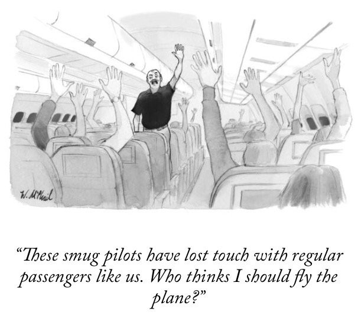
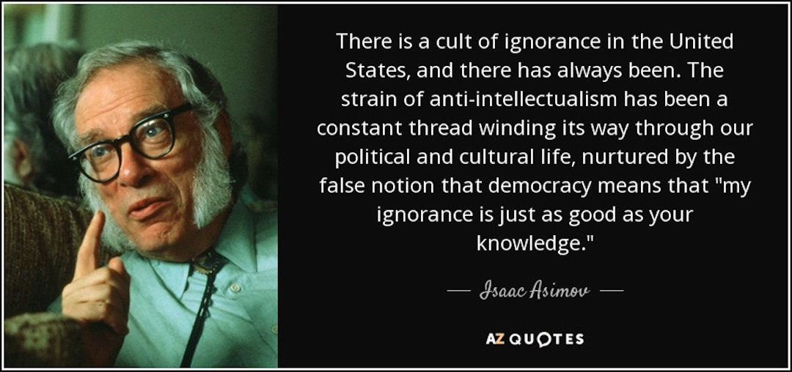
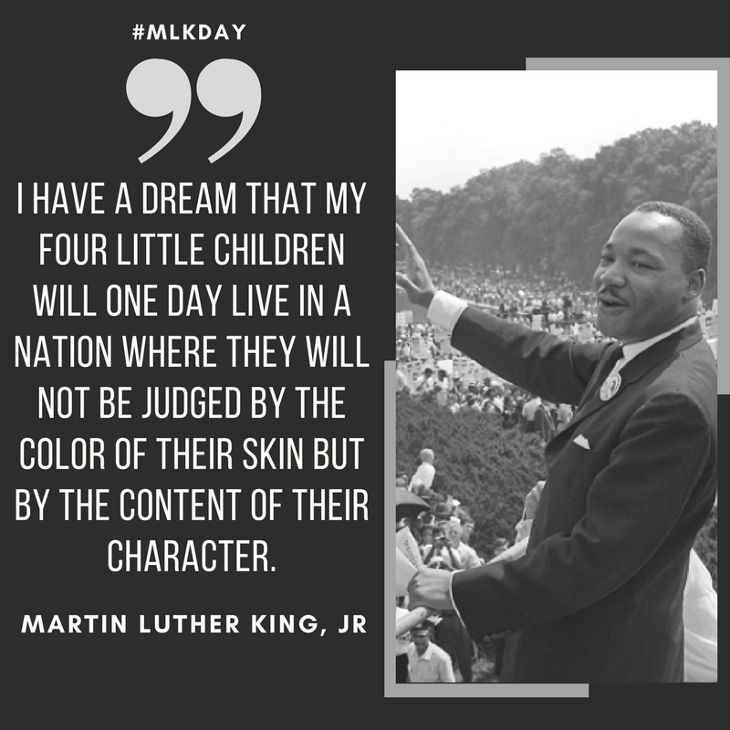
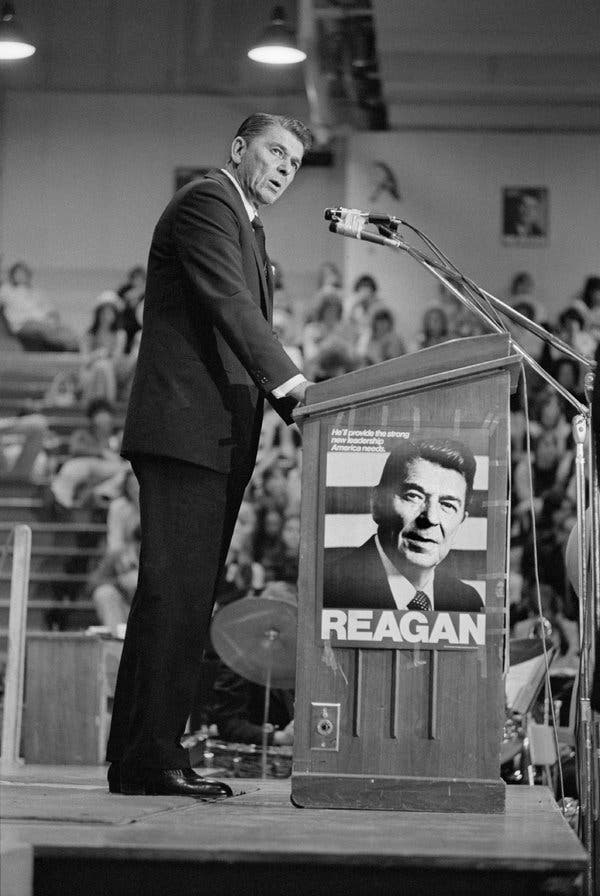
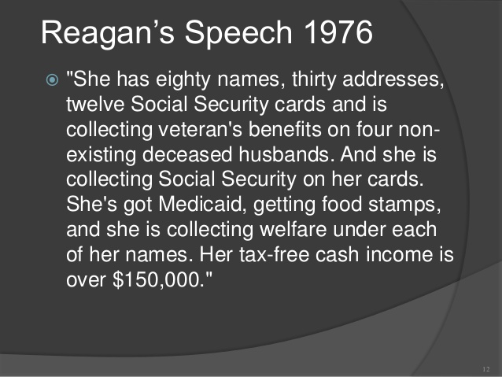
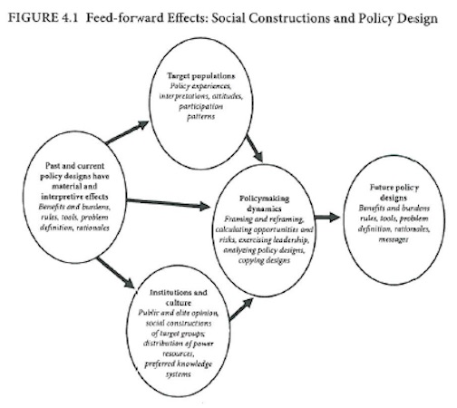
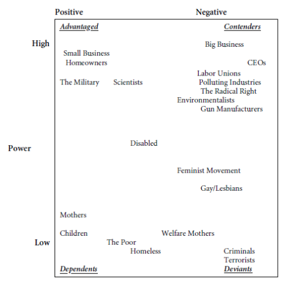

  
```{r setup, include=FALSE}
knitr::opts_chunk$set(warning = FALSE, message = FALSE, 
                      fig.retina = 3, fig.align = "center")
```

```{r xaringanExtra, echo=FALSE}
xaringanExtra::use_webcam()
```

.pull-left[
# Equality and Social Constructions 
<figure>
  
</figure>
]

.pull-right[

</br>
</br>
</br>
**EVSS-PUBA 602: Public Policy**

**Fall 2021**

.light[Matthew Nowlin, PhD<br>
Department of Political Science<br>
College of Charleston
]

]

---

<figure>
<center>
  
</figure>

???
populism 
elitism 
technocracy 
---

<figure>
<center>
  
</figure> 

---

class: center, middle 

# What is _intrinsic equality_? 

???
treat all people as if they possess equal claims to life, liberty, and happiness why? 
* **Ethical and religious grounds**: treat others as you would like to be treated 

* **The weakness of an alternative principle**: interest of one $>$ interest of another? 

* **Prudence**: cautious use of government 

* **Acceptability**: likely to acceptable to a large number of individuals 

---

class: center, middle

# Can we govern ourselves? 

???
why not guardianship?
- delegate certain decisions is not the same as ceding final control over major decisions (experts on tap, not top)
- personal decisions by individuals not the same as by the state 
- governing requires more than scientific knowledge 
- governing take more than knowledge (incorruptibility)
- capacity to bring about utopia 

---

class: center, middle

# _Every adult subject to the laws of the state should be considered to be sufficiently well qualified to participate in the democratic process of governing that state_ 

.pull-left[
-Dahl, pg. 76
]

???
can we trust people to decide what is best for them? 
---

class: center, middle 

# Targeted universalism 

---

class: title title-1

# Universalism in Public Policy

.pull-left[
<figure>
  
</figure>
]

--

.pull-right[
Is "race-blindness" enough to ensure equality (or equity) in public policy? 
]

???
individualistic understanding of race / racism 
---

class: title title-1

# Universalism in Public Policy

.pull-left[
<figure>
  
</figure>
]

.pull-right[
Is "race-blindness" enough to ensure equality (or equity) in public policy? 

Are _universal_ public policies really _universal_?
]

???
what's an alternative?
aristotle: unjust to treat those situated differently the same  
---

class: middle 

**Targeted universalism**: _inclusive of the needs of both dominant and marginal groups, but pay particular attention to the situation of the marginalized group_

???
_rejects a blanket approach that is likely to be indifferent to the reality that different groups are situated differently relative to the institutions and resources of society. It also rejects the claim of formal equality that would, as a way of denying difference, treat all people the same. Any proposal would be evaluated by the outcome as well as the intent. While the effort would be universal for the poor, it would be especially sensitive to the most marginalized groups._ (pg. 24)
---

class: center, middle 

# Social Constructions 

---

class: center, middle 

# What are social constructions and how do they impact public policy? 

---

class: title title-1

# Reagan and "Welfare Queens"

.pull-left[
<center>
<figure>
  
</figure>
]


.pull-right[
<figure>
  
</figure>
]

???
real story: https://www.pbs.org/newshour/show/the-true-story-behind-the-welfare-queen-stereotype

---

class: title title-1

# Social Construction

**Policymakers construct _target populations_ in positive or negative terms and these terms are reflected in the distribution of benefits and burdens within policy designs** 

--

1. _The value judgments that policymakers express when justifying their agendas to legislatures and the public_ 

--

2. _The enduring impact of these value-driven policies beyond the terms of single elections (and often long after they have left office)_

---

class: title title-1

# Social Construction

* _Elected officials articulate value judgments and make fundamental choices about which social groups should be treated differently by government bodies_ 

--

* _These judgments can have an enduring ‘feed-forward’ effect: fundamental choices based on values are reproduced in the institutions devoted to policy delivery_

--

* _This decision has an impact on citizens and groups, who participate more or less in politics according to how they are characterized by government_

---

class: title title-1

# Social Construction

.pull-left[
<figure>
  
</figure>
]

--

.pull-right[
<figure>
  
</figure>
]

---

class: title title-1

# For Next Time 

**The Policymaking Process**

* **Birkland**, Chap 2, _Elements of the Policy Making System_ (**pages 32-37, skim the rest**) 
* **Cairney blog post**: [The Policy Cycle and its Stages](https://paulcairney.wordpress.com/2013/11/11/policy-concepts-in-1000-words-the-policy-cycle-and-its-stages/)
* **Cairney blog post**: [The Policy Process](https://paulcairney.wordpress.com/2017/07/11/policy-concepts-in-1000-words-the-policy-process/)
* Dye, Thomas R. 2013. Chap 1, _Models of Politics: Some Help in Thinking About Public Policy_
* __Birkland__ Chap 3, _The Contexts of Public Policy Making_ 


