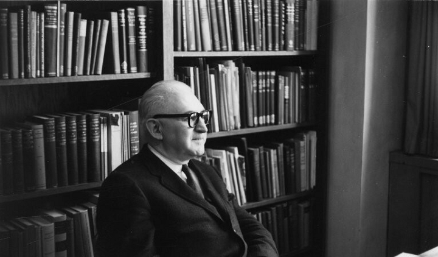

  
```{r setup, include=FALSE}
knitr::opts_chunk$set(warning = FALSE, message = FALSE, 
                      fig.retina = 3, fig.align = "center")
```

```{r xaringanExtra, echo=FALSE}
xaringanExtra::use_webcam()
```

.pull-left[
# The Policymaking Process
<figure>
  
</figure>
]

.pull-right[

</br>
</br>
</br>
**EVSS-PUBA 602: Public Policy**

**Fall 2021**

.light[Matthew Nowlin, PhD<br>
Department of Political Science<br>
College of Charleston
]

]

---

class: title title-1

# Why Policy? 

**Public policies are in response to a societal _problem_** 

--

**Market failures** 
* Market processes allocate goods and services _efficiently_, when certain conditions are (mostly) met
  * Competitive  
  * Full information 
  * Complete 

---

class: title title-1

# Why Policy? 

**Public policies are in response to a societal _problem_** 

**Market failures** 
* Market processes allocate goods and services _efficiently_, when certain conditions are (mostly) met
  * ~~Competitive~~ _Monopoly_   
  * ~~Full information~~ _Asymmetric information_  
  * ~~Complete~~ _Externalities_

---

class: title title-1

# Why Policy? 

**Public policies are in response to a societal _problem_** 

**Market failures** 
* Market processes allocate goods and services _efficiently_, when certain conditions are (mostly) met
  * ~~Competitive~~ _Monopoly_   
  * ~~Full information~~ _Asymmetric information_  
  * ~~Complete~~ _Externalities_ 
  * **Type of good**: common-pool resource, public

---

class: center, middle

# How can we understand the complex process of policymaking?

---

class: title title-1

# Studying Public Policy 

**Harold Laswell and the Policy Sciences** 

.pull-left[
<figure>
  
</figure>
]

.pull-right[

* Knowledge *of* the policy process
    * How policy is made 

* Knowledge *in* the policy process
    * Policy analysis 
    * Policy evaluation 
]

---

class: title title-1

# Studying Public Policy 

<figure>
<center>
  
</figure>

---

class: title title-1

# Studying Public Policy 

**Paul Sabatier** 

.pull-left[
<figure>
  
</figure>

_Develop theory_ 
]

--

.pull-right[
The policy process is one of “staggering complexity”, therefore it must be _simplified_
-  Identifying what is important
-  Defining categories in which phenomena are to be grouped
]

---

class: title title-1

# Studying Public Policy 

**Paul Sabatier** 

.pull-left[
<figure>
  
</figure>

_Develop theory_ 
]

.pull-right[
Two ways to simplify:
-  Ad hoc: arise from experience, context dependent

-  Scientific method
]

---

class: middle, center 

# How _generalizable_ can our insights about policymaking be?

---

class: center, middle 

# Epistemology

--

# How do we know what we know? 

---

class: title title-1

# Scientific Method 

**What is the scientific method?**

--

> _A method or procedure that has characterized natural science since the 17th century, consisting in systematic observation, measurement, and experiment, and the formulation, testing, and modification of hypotheses._

.tr[-_Oxford English Dictionary_]

---

class: title title-1

# Criteria of a Scientific Theory

**Paul Sabatier** 

--

-  Data acquisition and analysis methods are public and can be replicated 

--

-  Concepts and propositions should be clearly defined, logically consistent, and lead to empirically falsifiable hypotheses


--

-  Propositions should be general
    -  _Proposition_: (i.e., logic statement) declarative statement that is either true or false 

---

class: title title-1

# Criteria of a Scientific Theory

**Paul Sabatier** 


-  Methods and concepts subjected to criticism and evaluation

--

* Applies to both _quantitative_ and _qualitative_ data 

---

class: title title-1

# Criteria of a Scientific Theory

**Iron law of explanation** 

> The rule is simple: it tells scientists that, “if they are to participate in the scientific enterprise, they must uncover or generate new evidence to argue with”; from there, they must “conduct all disputes with reference to empirical evidence alone.”

.tr[-Michael Strevens]


<br>
.box-1.tiny[How Does Science Really Work? _The New Yorker_ September 2020]

---

class: title title-1

# Frameworks, Theories, and Models 

<figure>
<center>
  
</figure>

---

class: title title-1

# Frameworks, Theories, and Models 

.pull-left[
<figure>
  
</figure>
]

.pull-right[
__Frameworks__: 
* _most abstract_ 

* bound inquiry and direct attention to critical features
]

---

class: title title-1

# Frameworks, Theories, and Models 

.pull-left[
<figure>
  
</figure>
]

.pull-right[
__Theories__: 
* _less abstract_

* determine important variables, posit _causal_ relationships among variables, and make predictions 
]

---

class: title title-1

# Frameworks, Theories, and Models 

.pull-left[
<figure>
  
</figure>
]

.pull-right[
__Models__: 

* _least abstract_ 

* make precise assumptions about a limited set of parameters and variables

* $Y_{i} = \alpha + \beta X_{i} + \epsilon_i$
]

---

class: title title-1

# Frameworks, Theories, and Models 

.pull-left[
<figure>
  
</figure>
]

.pull-right[
__Models__: 

* _least abstract_ 

* make precise assumptions about a limited set of parameters and variables

* $Y_{i} = \alpha + \beta X_{i}$
]

---

class: title title-1

# Frameworks, Theories, and Models 
**Thomas Dye**

--

* Order and simplify reality

--

* Identify what is significant

--

* Be congruent with reality

--

* Provide meaningful communication

--

* Direct inquiry and research

--

* Suggest explanations

---

class: title title-1

# Studying Public Policy 

**How can we understand the complex process of policymaking?** 

--

* **Policymaking as _stages_**

--

* **Policymaking as a _system_**

--

* **Policymaking as a _process_**

---

class: title title-1

# Policy Stages (Cycle)

.pull-left[
</br>
</br>

]

.pull-right[


]

???
how is this useful in understanding the policy process?

---

class: title title-1 

# Policy Stages (Cycle)

<figure>
<center>
  
</figure>

.box-1.tiny[From: Benoit, François. 2013. _Public Policy Models and Their Usefulness in Public Health: The Stages Model_. National Collaborating Centre for Healthy Public Policy. Briefing Note.]

---

class: title title-1 

# Policy Stages (Cycle)

.pull-left[
**Strength** 
* Provides an intuitive and practical means of conceptualizing and organizing the study of public policy
]

--

.pull-right[
**Weaknesses**
* Descriptive inaccuracy; stages are not distinct

* Top–down focus

* Neglects intergovernmental relations
]


---

class: title title-1

# Policymaking System 

<br>

.pull-left[

]

--

.pull-right[
**Inputs $\rightarrow$ "System" $\rightarrow$ Output**  

</br>

**What happens in the black box**? 

]

---


class: title title-1  

# Policymaking Process

.pull-left[

</br>
</br>

**How do these parts interact to produce policy outputs?** 
]

.pull-right[
<figure>
  
</figure>
]

---

class: title title-1

# Dye: Models of Politics 

<br>

.pull-left-3[
<figure>
  
</figure>
]

.pull-middle-3[
<figure>
  
</figure>
]

.pull-right-3[
**Institutionalism** 

**Rationalism**

**Incrementalism**

**Group Theory**     

**Elite Theory** 
]

---

class: title title-1 

# Institutionalism 

**Institutionalism**: _Public policy is authoritatively determined, implemented, and enforced by government institutions_

* Congress, the presidency, courts, bureaucracies

--

Government institutions give public policy three distinctive characteristics:
  * Legitimacy: legal obligations; democratic; the Constitution
  * Universality: extends to all citizens 
  * Coercion: imprison violators 

---

class: title title-1

# Rationalism

* Rational policy achieves maximum social gain

--

* _Maximize social welfare_ 
    * Policy analysis 
    * Benefit-cost analysis 
    * Policy evaluation 

--

* _Comprehensive_ vs. _bounded_ rationality 

---

class: title title-1


# Incrementalism

.pull-left[
* Policymaking under constraint
    * Time
    * Information
    * Cost

* Base + or -

* Applied to public budgets
]

.pull-right[
</br>
<figure>
  
</figure>
]


---

class: title title-1 

# Group Theory

**Individuals with common interests band together formally or informally to press their demands on government**

--

.pull-left[.SMALL[
* __Pluralism__

* Role of political institutions:
    * Establish rules
    * Arrange compromises and balance interests
    * Enact compromise (policy)
    * Enforce compromise]
]

.pull-right[

]

---

class: title title-1

# Elite Theory

.pull-left[
</br>
**Policy demands flow downward from the elite, not upwards from the public**
]

.pull-right[
<figure>
   
</figure> 
]

---

class: title title-1

# For Next Time 

**Institutions, Actors, and Subsystems**

_Readings_:
* Dahl, Robert A., Chap 8, _What Political Institutions Does Large-Scale Democracy Require?_ 
* **Cairney blog post** [Institutions and New Institutionalism](https://paulcairney.wordpress.com/2014/03/28/policy-concepts-in-1000-words-institutions-and-new-institutionalism/)
* **Birkland**, Chap 4, _Official Actors and Their Roles in Public Policy_
* **Birkland**, Chap 5, _Unofficial Actors and Their Roles in Public Policy_
* **Cairney blog post** [Networks, Sub-government, and Communities](https://paulcairney.wordpress.com/2014/03/25/policy-concepts-in-1000-words-networks-sub-government-and-communities/)
* Anderson, James A., _Levels of Politics_ 


