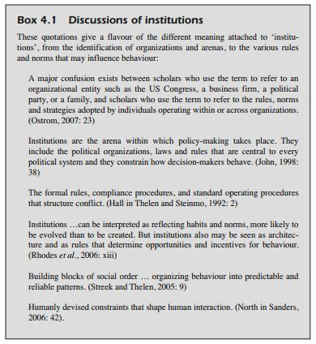
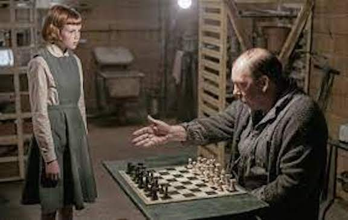
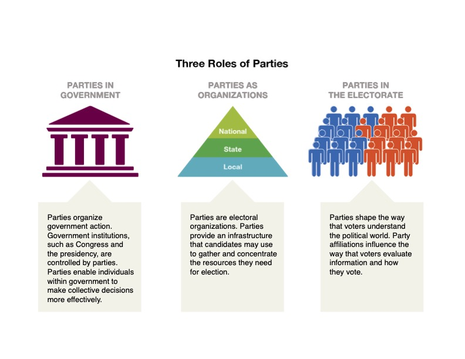

  
```{r setup, include=FALSE}
knitr::opts_chunk$set(warning = FALSE, message = FALSE, 
                      fig.retina = 3, fig.align = "center")
```

```{r xaringanExtra, echo=FALSE}
xaringanExtra::use_webcam()
```

.pull-left[
# Institutions, Actors, and Subsystems
<figure>
  
</figure>
]

.pull-right[

</br>
</br>
</br>
**EVSS-PUBA 602: Public Policy**

**Fall 2021**

.light[Matthew Nowlin, PhD<br>
Department of Political Science<br>
College of Charleston
]

]

---

class: center, middle

# What are policymaking institutions? Who are policy actors? What are subsystems? Why are they important?

---

class: title title-1

# Policymaking System 

<figure>
<center>
  
</figure>


---

class: title title-1 

# Institutions 

--

.pull-left[
**Institutions and democracy**  

* _What institutions does democracy require_? 
]

--

.pull-right[
**Definitions of institutions** 

* Branches of government
* Birkland and Cairney 
* New institutionalism 
]

---

class: title title-1

# Institutions and Democracy 

<br>

> If a _country_ is to be governed democratically, what would be required? At a minimum, it would need to possess certain political arrangements, practices, or institutions that would go a long way, even if not all the way, toward meeting ideal democratic criteria. 

> — Dahl, pg 83

---

class: title title-1 

# Institutions and Democracy 

**What political institutions does large-scale democracy require?** 

--

* Elected officials

--

* Free, fair, and frequent elections

--

* Freedom of expression 

--

* Alternative sources of information 

--

* Associational autonomy 

--

* Inclusive citizenship 

---

class: title title-1

# Institutions and Democracy 

**What political institutions does large-scale democracy require?** 

_Elected officials_ 

* Effective participation 
* Control of the agenda 

--

_Free, fair, and frequent elections_ 
* Voting equality 
* Control of the agenda

---

class: title title-1

# Institutions and Democracy 

**What political institutions does large-scale democracy require?** 

_Freedom of expression_ 
* Effective participation 
* Enlightened understanding 
* Control of the agenda 

---

class: title title-1

# Institutions and Democracy 

**What political institutions does large-scale democracy require?** 


_Alternative sources of information_ 
* Effective participation 
* Enlightened understanding 
* Control of the agenda 

---

class: title title-1

# Institutions and Democracy 

**What political institutions does large-scale democracy require?** 


_Associational autonomy_ 
* Effective participation 
* Enlightened understanding 
* Control of the agenda 

--

_Inclusive citizenship_ 
* Full inclusion 

---

class: title title-1

# What do we mean by _institutions_? 

**Institutions** (Dye): _Public policy is authoritatively determined, implemented, and enforced by government institutions_

--

.pull-left[
**The three branches of government** 
* Legislative 
* Executive 
* Judicial 
* _Official Actors_ 
]

.pull-right[
<figure>
<center>
  
</figure>
]

---

class: title title-1

# Separation and sharing of powers 

</br> 

| Congress | President | Courts 
--- | --- | --- | --- 
Legislative | **make laws** | recommend laws, veto, regulations | review laws  
Executive | override vetos, oversight | **enforce and implement laws** | review executive acts 
Judicial | advise and consent | pardon, nominate judges | **interpret laws** 

---

class: title title-1

# What do we mean by _institutions_? 

.pull-left[
<figure>
  
</figure>
]

--

.pull-right[

_Organizations as well as systems in which individuals interact and achieve political and policy goals through explicit and implicit rules that evolve over time through cooperative means_

-*Birkland*, pg 114 
]

---

class: title title-1

# What do we mean by _institutions_? 

**The rules of the game**

--

.pull-left[
 
**Formal** 

**Informal**

**New institutionalism**
* Regular patterns of behavior
* Rules, norms, practices and relationships that influence such behavior
]

.pull-right[

]

---

class: title title-1

# Institutions 

--

* Institutions are understood to be a formal bounded framework of rules, roles, and identities 

--

* Policy = Preferences * Institutions 

--

* Preferences (what people want) can be shaped by institutions 

--

**Logic of appropriateness**:  
Human action as driven by rules of appropriate or exemplary behavior, organized into institutions. Rules are followed because they are seen as natural, rightful, expected, and legitimate.

---

class: title title-1

# Policy Actors

--

.pull-left[
**Types of actors** 
* Official 
* Unofficial 
]

--

.pull-right[
**Interest groups** 
* Kinds of interest groups 
* What they do 
* Theories about interest groups 
]

---

class: title title-1

# _Official_ and _Unofficial_ Actors 

**Official actor**: A participant in the policy process whose involvement is motivated or mandated by their _official position in a government agency or office_ 

--

</br>


**Unofficial actor**: A participant in the policy process who does _not_ have constitutionally or legally created incentives or mandates to be a part of the process, yet are important to the policy process 


---

class: title title-1

# Unofficial Actors


.pull-left[
**Individual citizens**

**Political parties**

**Think tanks and research groups**

**Media** 

**_Interest groups_**
]

.pull-right[
<figure>
  
</figure>
]


---

class: title title-1

# Political Parties 

<figure>
<center>
  
</figure>

<br>

---

class: title title-1 

# The Media: Framing 

**Increases in murder in 2020** 

--

.pull-left[
<figure>
<center>
  
</figure>
]

--

.pull-right[
<figure>
<center>
  
</figure>
]


---

class: title title-1

# Interest Groups

_A collection of people or organizations that unite to advance their desired political outcomes (preferences) in government and society_

--

**Kinds of interest groups** 

* **Institutional**
    * Membership because you belong to a particular category

--

* **Membership**: groups you _choose_ to join 
    * Economic (private interest)
    * Public interest groups

---

class: title title-1 

# What Interest Groups Do

.pull-left[
**What people think they do ...** 
<figure>
  
</figure>
]


--

.pull-right[
**... what they actually do**
* _Venue shopping_ 
* Lobbying
* Support candidates* 
* Mobilize members to take action


<br>
.footnote[.small[*Mostly their friends]]
]


---

class: title title-1

# Interest Groups: Theories 

**Pluralism (Group Theory)**


--

* Groups are mobilized in response to changes in society and/or the _policymaking_ environment 


--

* All groups / interests in society are represented, thereby supporting democratic governance

--

* Interest groups largely provide information

--

* **Mobilization and counter-mobilization** 

---

class: title title-1

# Interest Groups: Theories 

**Elitism** 

.pull-left[
</br>

*Policy demands flow downward from the elite not upwards from the public* 
]

.pull-right[


]

---

class: title title-1

# Interest Groups: Theories 

**The Economic Perspective (Exchange theory)** 

--

* Olson (1965), _The Logic of Collective Action_ 
    * _Free-riding_ 

--

* _Exchange_ between interest groups and politicians 
    * Lobbying, Super-PACs 

--

* Few interests are represented; "capture"

---

class: title title-1

# Interest Groups: Theories 

**Neopluralism** 

--

</br>
A _blending_ (kinda) of pluralism, elitism, and exchange theory
* Depends on context

---

class: title title-1

# Interest Groups: Theories 

**Neopluralism** 

Assumes: 

--

.small[
* Policymaking is a lengthy processes that involves multiple decisions
* Major policy changes involve multiple competing groups
* Government officials are not neutral but are themselves effective lobbyists
* Political ideologies, political parties, and elections reduce interest group influence
* The free rider problem does not prevent effective competition
* Institutions matter
* Interest group influence is highly contingent on particular characteristics of the political environment and of the issue 
]

---

class: center, middle 

# What are policy subsystems? 

.footnote[... or networks, sub-governments, and communities]

---

class: title title-1 

# Levels of Politics 

**Micropolitics**

* Very narrow, with little broad interest 
    
--

**Meso-level**

* _Policy subsystems_

--

**Macropolitics** 

* Attract wide interest and participation from citizens and political elites; from the media and the major policymaking institutions 
    
---

class: title title-1

# What are Policy Subsystems?

> Substantive issue alliances that cross institutional boundaries and include both governmental [official] and nongovernmental [unofficial] actors

> — *McCool* 1998, pg 551


--

**Subsystems are organized around a _policy domain_** 

* _Policy domain_: Substantive area of policy over which participants in policy making compete and compromise

---

class: title title-1

# Subsystem Types 

**Iron Triangles and Issue Networks** 


---

class: title title-1

# For Next Time 

**Agenda Setting and the Multiple Streams Approach**

_Readings_:
* Birkland Chap 6, Agenda Setting, Power, and Interest Groups
* Cairney blog post: Multiple Streams Analysis
* WS Chap 1: Herweg, et al., The Multiple Streams Framework
* _Find a peer-reviewed journal article on agenda setting and/or the Multiple Streams Approach and post it to the discussion board on OAKS_ 


