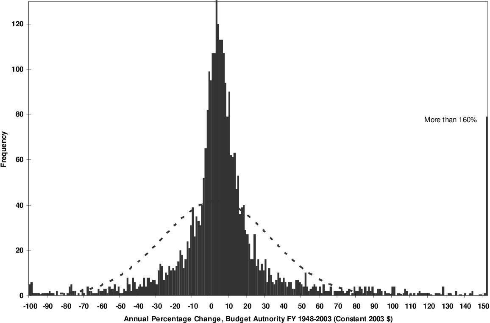

  
```{r setup, include=FALSE}
knitr::opts_chunk$set(warning = FALSE, message = FALSE, 
                      fig.retina = 3, fig.align = "center")
```

```{r xaringanExtra, echo=FALSE}
xaringanExtra::use_webcam()
```

.pull-left[
# Punctuated Equilibrium Theory
<figure>
  
</figure>
]

.pull-right[

</br>
</br>
</br>
**EVSS-PUBA 602: Public Policy**

**Fall 2021**

.light[Matthew Nowlin, PhD<br>
Department of Political Science<br>
College of Charleston
]

]

---

class: center, middle

# _Never confuse a theory of football with a theory of putting on pants_ 

.right[-Bryan Jones] 

---

class: title title-1

# Punctuated Equilibrium Theory

<br>
<br>
.large[**What aspect(s) of the policy process is it explaining?**] 

???
policy change 
observed periods of policy stasis, incrementalism, and large policy change
---

class: title title-1

# Theoretical Antecedents

 __Incrementalism__ (Lindblom)

* Time constraints and/or political limitations prevent full (rational) consideration of policy issues 

* Policymakers rely on past decisions resulting in a policy process of small adjustments 

* Policymakers start from existing baseline and make adjustments based on pressures from the current environment

--

**Does not allow for rapid or large policy change, which often occurs**

---

class: title title-1

# Theoretical Antecedents

**Mobilization and expansion of conflict** (Schattschneider) 

* _Loser appeal_: "losers" in policy conflicts attempt to expand conflict 

* Concerned outsiders

* Jurisdictional expansion 

---

class: title title-1

# Theoretical Antecedents

__Policy subsystems__

* _Substantive issue alliances that cross institutional boundaries and include both governmental (official) and nongovernmental (unofficial) actors_ (McCool 1998)

* Allow for the _parallel processing_ of issues 

---

class: title title-1

# Punctuated Equilibrium Theory

</br>
</br>
.large[**What concept(s) does the theory use to drive its explanations?**] 

???

---

class: title title-1

# PET Concepts 
**Cairney blog post** 

* Bounded rationality

* Disproportionate attention

* Power and agenda setting

* Framing (Policy image)

* Policy monopolies

* Venue shopping

---

class: title title-1

# PET Concepts 
**Baumgartner, Jones, and Mortensen book chapter**

.pull-left[
* Serial and parallel processing 
* Positive and negative feedback 
* Information processing
  * Information = signals
  * Disproportionate (over/under react)
  * _The paradox of search_ 
]

.pull-right[
* Macro-politics
* Subsystem politics
* Decision-making and attention
]

---

class: title title-1

# Punctuated Equilibrium Theory 

__Punctuated Equilibrium Theory proposes a single process that explains both stability and bursts of rapid change__

--

* _The interaction of a changing policy image with political institutions (i.e., policy venues)_

* _Feedback dynamics_ 

* _Attention to new issues or new aspects of issues_ 

---

class: title title-1

# Punctuated Equilibrium Theory 

* _The interaction of a changing policy image with political institutions (i.e., policy venues)_

* _Feedback dynamics_ 

* _Attention to new issues or new aspects of issues_ 

**These processes push issues from subsystems to the macro-institutions, making policy change more likely and altering existing policy subsystems** 

---

class: title title-1

# Budget Example

<figure>
<center>
  
</figure>

---

class: title title-1

# Punctuated Equilibrium Theory

</br>
</br>
.large[**Tell us about your article**] 

---

class: title title-1

# Punctuated Equilibrium Theory

</br>
</br>
.large[**What have you learned about the policy process?**] 

---

class: title title-1

# For Next Time 

.huge[**FALL BREAK**]

<br>
:(

---

class: title title-1

# For Next, Next Time 

**Advocacy Coalition Framework** 

.small[_Readings_:]

.small[* **Cairney blog post**: [The Advocacy Coalition Framework](https://paulcairney.wordpress.com/2013/10/30/policy-concepts-in-1000-words-the-advocacy-coalition-framework/)

* __WS__ Chap 4: Jenkins-Smith, Nohrstedt, Weible, and Ingold, _The Advocacy Coalition Framework: An Overview of the Research Program_

* Weible, Christopher M, and Karin Ingold. 2018. “Why Advocacy Coalitions Matter and Practical Insights About Them.” _Policy & Politics_ 46(2): 325–43.

* _Find a peer-reviewed journal article using the ACF_]  

---

class: title title-1

# Group Exercise 

* Get in groups of _no more than four_ (practice social distancing) 

* Go to the _Comparative Agendas Project_ webpage: https://www.comparativeagendas.net 

* Go to the __Explore Trends Tool__ 

* Pick a policy _sub-topic_ in the US  

* Explain the dynamics of that sub-topic 
    * When did a punctuation occur? 
    * Any guesses as to why that punctuation happened?

