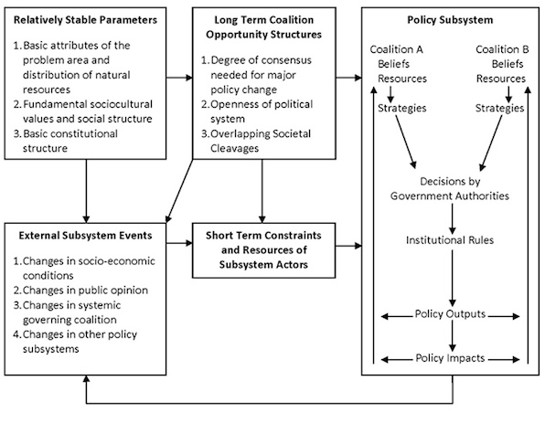

  
```{r setup, include=FALSE}
knitr::opts_chunk$set(warning = FALSE, message = FALSE, 
                      fig.retina = 3, fig.align = "center")
```

```{r xaringanExtra, echo=FALSE}
xaringanExtra::use_webcam()
```

.pull-left[
# Advocacy Coalition Framework
<figure>
  
</figure>
]

.pull-right[

</br>
</br>
</br>
**EVSS-PUBA 602: Public Policy**

**Fall 2021**

.light[Matthew Nowlin, PhD<br>
Department of Political Science<br>
College of Charleston
]

]

---

class: middle 

> _Along with scholars, audiences for this paper may also include people actively engaged in politics involving public policy issues or undergraduate or graduate students, who through their courses and readings are learning about various theories of public policy and politics and wondering how – if at all – these theories might matter in a career outside the craft and science of academic theoreticians_ 

-Weible and Ingold 2018

---

class: title title-1

# Frameworks, Theories, and Models 

<figure>
<center>
  
</figure>

---

class: title title-1

# Theoretical Antecedents

* Policy subsystems and issue networks 
* Bounded rationality 
* Policy stages model 
  * Paul Sabatier's work on implementation

--

* Belief system work in political science and public opinion 

--

* Lakatos on science 
  * "Hard core" and "protective belt" 

???
Hank's time at DOE
---

class: title title-1

# Advocacy Coalition Framework 

<br>
<br>
.large[**What aspect(s) of the policy process is it explaining?**] 

---

class: title title-1

# ACF According to Cairney 

<figure>
<center>
  
</figure>

---

class: title title-1 

# Advocacy Coalition Framework 

</br>
</br>
.large[**What concept(s) does the theory use to drive its explanations?**]

---

class: title title-1

# ACF Diagram 

<figure>
<center>
  
</figure>


---

class: title title-1

# ACF Assumptions 

--

* The policy subsystem is the main unit of analysis 

--

* Relevant subsystem actors include any person trying to influence policy

--

* Individuals are boundedly rational, motivated by beliefs, prone to the "devil shift"

--

* Subsystems are simplified by aggregating actors into one of more coalitions 

---

class: title title-1

# ACF Assumptions 


* Policies incorporate implicit theories based on the beliefs of one or more coalitions

--

* Scientific and technical information is important

--

* Researchers should adopt a long-term perspective, a decade or more, to understand policy process and change 

---

class: title title-1

# ACF's Key Terms

--

**Beliefs and Belief systems**  

* Beliefs and belief-systems are hierarchically organized

--

* Core Beliefs $\rightarrow$ Policy Core Beliefs $\rightarrow$ Secondary Aspects 

--

**Advocacy Coalitions** 

* Actors that share _policy core beliefs_ and coordinate their actions in a non-trivial manner to influence a policy subsystem 

---

class: title title-1

# Advocacy Coalitions 

.pull-left[
* Dominant and minority coalitions
* Collective action (free-riding)
* Principal and auxiliary coalition actors 
* Resources, strategies, and activities 
]

.pull-right[
<br>
<center>
 
]

---

class: title title-1

# Other Types of Political Associations 

**Coalitions of convenience** 
* _Bootleggers and Baptists_ 

--

**Epistemic community** 

--

**Social movement** 

--

**Political party** 

--

**Interest group and interest group coalitions** 

???
Weible and Ingold 2018, pg. 328

---

class: title title-1

# ACF's Key Terms

**Policy change** 

--

* External shock: _External_ to the subsystem 

--

* Internal shock: _Internal_ to the subsystem 

--

* Policy-oriented learning
    * _Enlightenment function_ 
--

* Negotiated agreement 


---

class: title title-1

# ACF's Key Terms

**Policy-oriented learning** 

</br>

_Enduring alterations of thought or behavioral intentions that result from experience and which are concerned with the attainment or revision of the precepts of the belief systems of individuals or of collectives_

---

class: title title-1

# Adovacy Coalition Framework

</br>
</br>
.large[**Tell us about your article**] 

---

class: title title-1

# Adovacy Coalition Framework

</br>
</br>
.large[**What have you learned about the policy process?**] 

---

class: title title-1

# For Next Time  

**Narrative Policy Framework**

_Readings_:
* **Cairney**: [Critical Policy Studies and the Narrative Policy Framework](https://paulcairney.wordpress.com/2015/03/06/policy-concepts-in-1000-words-critical-policy-studies-and-the-narrative-policy-framework/)
* __WS__: Chap 5: Shanahan, Jones, McBeth, Radaelli, _The Narrative Policy Framework_ 
* Crow, Deserai, and Michael Jones. 2018. “Narratives as Tools for Influencing Policy Change.” _Policy & Politics_ 46(2): 217–34.
* _Find a peer-reviewed journal article using the narrative policy framework_ 

---

class: title title-1

# Group Exercise 

* Get in your groups. I will count you off 

* Pick a policy issue, _that isn't climate change_  

* Find one or two _newspaper_ articles about your issue

* Use the articles to identify coalition members and their beliefs 

* Report out to the class 


