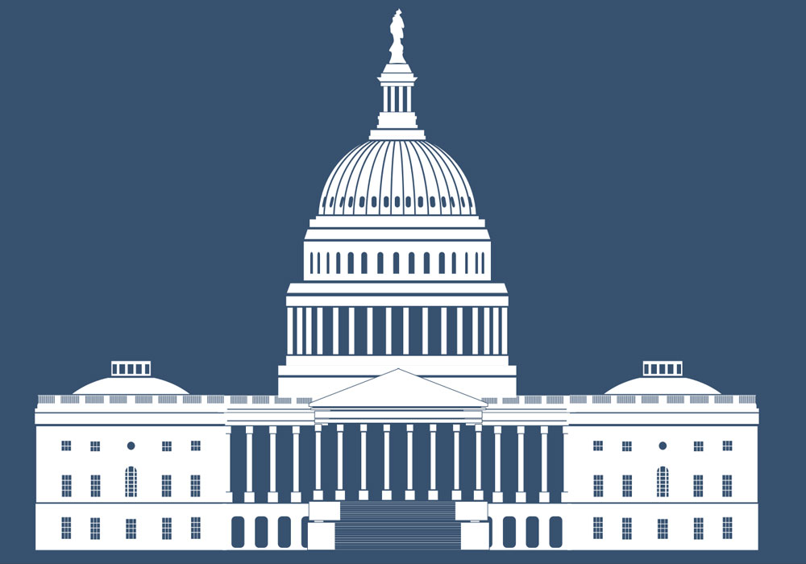
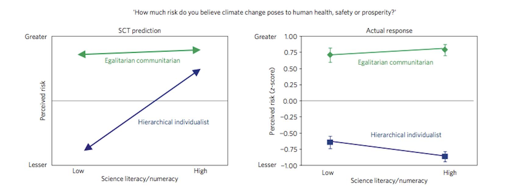
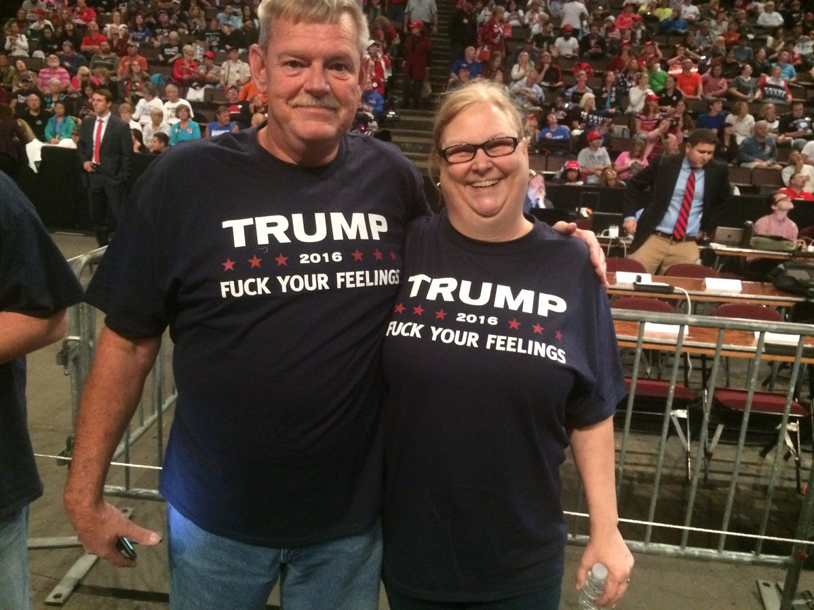

  
```{r setup, include=FALSE}
knitr::opts_chunk$set(warning = FALSE, message = FALSE, 
                      fig.retina = 3, fig.align = "center")
```

```{r xaringanExtra, echo=FALSE}
xaringanExtra::use_webcam()
```

.pull-left[
# Narrative Policy Framework
<figure>
  
</figure>
]

.pull-right[

</br>
</br>
</br>
**EVSS-PUBA 602: Public Policy**

**Fall 2021**

.light[Matthew Nowlin, PhD<br>
Department of Political Science<br>
College of Charleston
]

]

---

class: title title-1

# Epistemology 

--

**Post-Positivist** 

--

**Can we separate _facts_ from _values_?** 

--

**Knowledge _about the social world_ is dependent on social context** 
* Analyze _discourse_ and _narratives_ 
* Not _generalizable_ 

--

**Science produces knowledge according to rules, but does it uncover _truths_ about the world or a way to _interpret_ the world?**

---

class: title title-1

# Epistemology 

**What does the Narrative Policy Framework assert**?

--

</br>

_They argue that, although the study of policy ‘narratives’ (often using discourse analysis) is associated strongly with post-positivist scholarship, they can be examined in a ‘systematic empirical manner’ – and that the study of narratives can be an important way to help reconcile (to some extent) positivist/post-positivist studies_.

-_Cairney_ 

---

class: title title-1

# Narrative Policy Framework 

<br>
<br>
.large[**What aspect(s) of the policy process is the theory explaining?**] 

---

class: title title-1

# Narrative Policy Framework 

</br>
</br>
.large[**What concept(s) does the theory use to drive its explanations?**]

---

class: title title-1

# Policy Narratives

--

**Form**

* Structure of narratives 

--

**Components of a Policy Narrative** 

--

* Setting: the _context_ of the policy
* Characters: _victims_, _villains_, _heroes_
* Plot: the _arc of action_
* Moral: a _policy solution_ 

---

class: title title-1

# Policy Narratives

**Content** 

--

* Policy context and subject matter 
* Policy beliefs 
* Policy narrative strategies 
    * Scope of conflict 
    * Causal mechanisms 
    * Devil-angel shift 

---

class: title title-1

# NPF Assumptions

--

* **Social construction**: _meaning_ 

--

* **Bounded relativity**: what matters in policy debates is bounded

--

* **Generalizable structural elements**: the _form_ of policy narratives can be applied in different contexts

--

* **Three levels**: macro, meso, and **micro**

---

class: title title-1

# NPF Assumptions

**Micro level**: _Homo narrans_

--

> An evolving psychological model of the individual that acknowledges and tests the primacy of affect and narration in human decision-making and cognitive processes

-_Shanahan_ et al., pg. 180

---

class: title title-1

# Micro Level: _Homo Narrans_

--

* **Bounded rationality** 

--

* **Heuristics**

--

* **Primacy of affect**: _emotions precede reason_ 

--

* **Two kinds of cognition**
  * **System 1**: _automatic thought process_ 
  * **System 2**: _focused attention_ 

---

class: middle, center 

# A bat and a ball cost $1.10 in total. The bat costs $1.00 more than the ball. How much does the ball cost?

---

# Algebra 
## System 2 

### $$ x + (100 + x) = 110 $$ 

--

### $$ 2x + 100 = 110 $$ 

--

### $$ 2x = 10 $$

--

### $$ x = 5 $$ 

---

class: title title-1

# Micro Level: _Homo Narrans_

--

* **Hot cognition**: _thinking influenced by emotion_ 

--

* **Confirmation / disconfirmation bias** 

--

* **Selective exposure**

--

* **Identity-protective** 

--

* **Primacy of groups and networks** 

---

class: title title-1

# Micro Level: _Homo Narrans_


**Narrative cognition**  

_Narrative is the primary means by which human beings make sense of and situate themselves within the world_ 

--

**We think in stories** 

---

class: title title-1

# Applying the NPF 

**How could narratives be applied?**
* Tell us about your article 

--

**What is the knowledge fallacy?** 

--

**What is the empathy fallacy?** 

---

# Knowledge Fallacy 

<figure>
<center>
  
</figure>

---

# Empathy Fallacy 

.pull-left[
<figure>
<center>
  
</figure>
]

.pull-right[
<figure>
  
</figure>
]

---

class: title title-1

# Narrative Policy Framework

</br>
</br>
.large[**What have you learned about the policy process?**] 

---

class: title title-1

# For Next Time  

**The IAD and SES Frameworks** 

.small[
_Readings_:
* **Cairney**: [The Institutional Analysis and Development Framework (IAD) and Governing the Commons](https://paulcairney.wordpress.com/2019/02/03/policy-concepts-in-1000-words-the-institutional-analysis-and-development-framework-iad-and-governing-the-commons/)

* **Cairney**: [The Social-Ecological Systems Framework](https://paulcairney.wordpress.com/2019/02/03/policy-in-500-words-the-social-ecological-systems-framework/)

* __WS__ Chap 6: Schlager and Cox, _The IAD Framework and SES Framework: An Introduction and Assessment of the Ostrom Workshop Frameworks_ 
* _Find a peer-reviewed journal article using the IAD OR the SES framework_ 
]


<!-- 
* _Supplemental material_: [Women in Economics](https://learn.mruniversity.com/women-economics-series-elinor-ostrom/) -->


---

class: title title-1

# Group Activity 

Get in six groups. I will count you off 
.pull-left[
**Group issues** 
* Groups 1 and 3: Poverty 
* Groups 2 and 4: Guns/Gun Control 
* Groups 5 and 6: Abortion 
]

.pull-right[.small[
Construct a policy narrative that includes several narrative components including characters, plot, and moral

Your narrative should address the question: is the _status-quo_ sufficient or is _policy change_ needed?  
* Groups 1, 2, 5: status-quo 
* Groups 3, 4, 6: policy change]]


