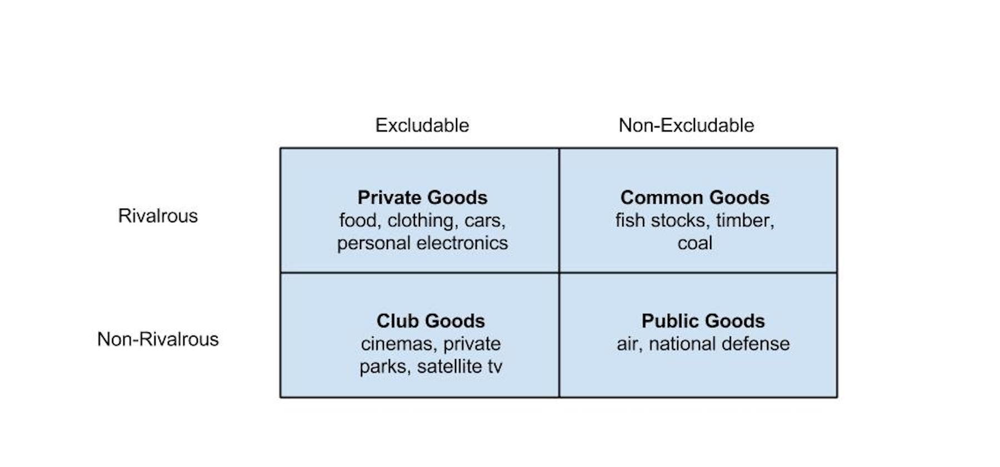
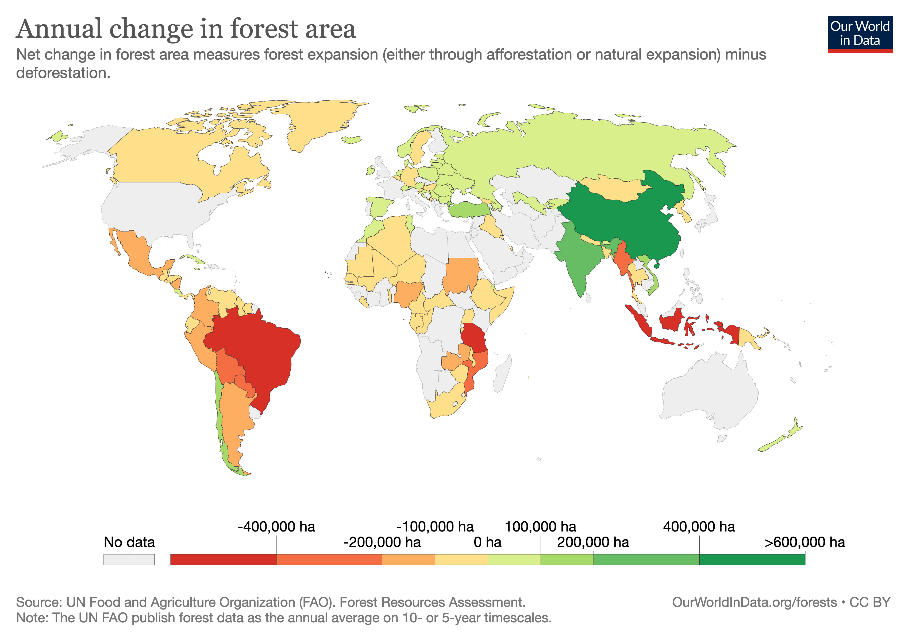

  
```{r setup, include=FALSE}
knitr::opts_chunk$set(warning = FALSE, message = FALSE, 
                      fig.retina = 3, fig.align = "center")
```

```{r xaringanExtra, echo=FALSE}
xaringanExtra::use_webcam()
```

.pull-left[
# The Ostrom Frameworks
<figure>
  
</figure>
]

.pull-right[

</br>
</br>
</br>
**EVSS-PUBA 602: Public Policy**

**Fall 2021**

.light[Matthew Nowlin, PhD<br>
Department of Political Science<br>
College of Charleston
]

]

---

class: center, middle 

# The Institutional Analysis and Development Framework ... 

---

class: center, middle 

# ... the Social-Ecological Systems Framework 

---

class: title title-1 

# Elinor Ostrom 

<figure>
<center>
  
</figure>

---

class: title title-1

# Types of Goods 

<figure>
<center>
  
</figure>

---

class: title title-1 

# Elinor Ostrom 

.center[
<iframe width="560" height="315" src="https://www.youtube.com/embed/D1xwV2UDPAg" title="YouTube video player" frameborder="0" allow="accelerometer; autoplay; clipboard-write; encrypted-media; gyroscope; picture-in-picture" allowfullscreen></iframe>
]

---

class: center, middle

# What is the _tragedy of the commons_?

---

<figure>
<center>
  
</figure>

---

class: title title-1 

# Fish Stocks

<figure>
<center>
  
</figure>

---

class: title title-1

# Forest Areas 

<figure>
<center>
  
</figure>

---

class: center, middle

# How can the tradegy of the commons be avoided?

???
typical responses include markets and governments 
---

class: title title-1

# Tragedy of the Commons 

**Approach 1: Markets** 

* Establish _property-rights_ 

* **Property-rights**: The rights to own or control property and includes the right to use, to transfer ownership, and exclude from others

--

**Approach 2: Governments** 

* Establish government regulation 

---

class: title title-1

# Ostrom 

.pull-left[
_The most important lesson that needs wide dissemination is that simple panaceas offered for solving problems related to the commons—whether they are for government, private, or community ownership—may work in some settings but fail in others_ 
]

.pull-right[
</br>

<figure>
  
</figure>
]


---

class: title title-1

# Governing the Commons 

.pull-left[
**Eight design principles**
.smaller[
- User and resource boundaries clearly defined and understood
- Congruence with local conditions
- Collective choice arrangements where individuals affected participate in decision-making
- Monitoring users and resource
- Graduated sanctions
- Conflict resolution mechanisms that are local and low-cost arenas to resolve conflicts
- Minimal recognition of rights; right of local users to make their own rules
- Nested enterprises 
]
]

.pull-right[
<figure>
<center>
  
</figure>

]

---

class: middle

## What aspect(s) of the policy process is the _Institutional Analysis and Development (IAD) framework_ explaining? What concept(s) does it use?

---

class: title title-1

# The IAD

**Institutions**: are human-constructed constraints or opportunities within which individual choices take place and which shape the consequences of their choices

* The **rules**, **norms**, and **shared strategies** that structure social interactions

--

.SMALL[**_Given that there is such a large variety of regularized social interactions in markets, hierarchies, families, legislatures, elections, and other situations, is it even possible to find a common terminology to study them? What are the building blocks of institutions?_**]

---

class: title title-1

# The IAD

<br>

<figure>
<center>
  
</figure>

---

class: title title-1 

# The IAD 

**Action arena**: occurs whenever individuals interact, exchange goods, or solve problems; **participants**, _rules and norms, and attributes of the physical world_ come together. 

--

**Action situation**: the rules and norms and the attributes of the physical world

--

**Interactions** 

--

**Evaluative criteria**: judging the performance of a system

---

class: title title-1

# The IAD 

<figure>
<center>
  
</figure>


---

class: title title-1

# IAD Components 

.pull-left[

* Biophysical conditions 
* Attributes of the Community 
* Rules-in-use
* **Participants**
* **Action situations** 
* _Interactions_ 
* _Outcomes_ 
* Evaluative criteria  
]

.pull-right[
<br>
<br>

]

---

class: title title-1

# The IAD 

**Exogenous Variables**

--

.pull-left[
**Biophysical conditions** 

* Characteristics of the good 
]

--

.pull-right[
**Attributes of the community**
* Trust 
* Reciprocity
* Shared understanding
* Social capital 
* Cultural repertoire 
]
???
Cultural Repertoire: set of strategies, norms, rules, organizational templates, and other remembered or imagined practices that are readily available to the members of that community for their use in processes of deliberation and implementation.

---

class: title title-1

# The IAD 

**Exogenous Variables**

**Rules-in-use**

.pull-left[
* Rules-in-form vs. rules-in-use
* Property rights
* _Grammar of Institutions_
  * _ADICO_
]

--

.pull-right[
* **ATTRIBUTES (A)** 
* **DEONTIC (D)** 
* **AIM (I)** 
* **CONDITIONS (C)** 
* **OR ELSE (O)** 
]

---

class: title title-1

# Rules, Norms, Shared Strategies 

**What are the differences between rules, norms, and shared strategies?** 

--

**Rules**: contain all five elements: ADICO 

_You must turn in your reflection papers when they are do or else you won't pass the class_ 

---

class: title title-1

# Rules, Norms, Shared Strategies 

**What are the differences between rules, norms, and shared strategies?** 

**Norms**: contain ADIC 

_You should raise your hand when you want to ask a question in class_ 

--

**Shared strategies**: contain AIC 

_Raise your hand when you want to ask a question in class_

---


class: title title-1

# Action Situations and Action Arenas

**Action situation**:  two or more individuals faced with a set of potential actions that jointly produce outcomes

* Participants that occupy a certain position 

--

**Action arena**: combines the action situation, which focuses on the rules and norms, with the participants who bring with them their individual preferences, skills, and mental models

--

**Typically the focal unit of analysis** 

---

class: title title-1

# Action Situations

<figure>
<center>
  
</figure>

---

class: title title-1

# Action Situations and Rules

<figure>
<center>
  
</figure>


---

class: title title-1

# Action Situations

**Operate at different levels**

--

**Constitutional level**: Actions taken directly affect rules that affect collective-choice situations 

--

**Collective-choice level**: Actions taken directly affect rules that affect operational situations  

--

**Operational level**: Actions taken directly affect variables in the world 

---

class: title title-1

# The IAD 

**Evaluative criteria** 

.pull-left[
* Efficiency 
* Equity 
* Legitimacy 
* Participation
]

--

.pull-right[
* Accountability 
* Fiscal equivalence 
* Consistent with moral values 
* Adaptability, resilience, robustness, or sustainability
]


---

class: title title-1

# The IAD 

<figure>
<center>
  
</figure>


---

class: title title-1

# The IAD 

<figure>
<center>
  
</figure>


---

class: title title-1

# The IAD 

<figure>
<center>
  
</figure>

---

class: title title-1

# The IAD 

<figure>
<center>
  
</figure>

???
Can we work through an example? maybe from an article you found

---

class: center, middle 

# What are Social-Ecological Systems? 

---

class: title title-1

# Social-Ecological Systems 

</br>
</br>

.large[**An ecological system intricately linked with and affected by one or more social systems**]

---

class: title title-1

# Social-Ecological Systems Framework 

<figure>
<center>
  
</figure>

---

class: title title-1

# Social-Ecological Systems Framework 

.pull-left[
<figure>
<center>
  
</figure>
]

--

.pull-right[
<figure>
<Center>
  
</figure>
]

---

class: title title-1

# Polycentricity 

**Polycentricity**: a social system composed of many decision centers having power to make decisions 

--

* Each decision center has limited and autonomous prerogatives 
* Operate under an overarching set of rules
* _Science_, _markets_, _federalism_

--

Compare to a **Monocentric system** with one center of power, such as a centralized state 

---

class: title title-1

# Next Time 

**Applying the Policy Process Theories**

**Readings**:
.small[
* Weible, Christopher M., Tanya Heikkila, Peter deLeon, and Paul A. Sabatier. 2012. “Understanding and Influencing the Policy Process.” Policy Sciences 45(1): 1–21
* Cairney, Paul, and Christopher M. Weible. 2017. “The New Policy Sciences: Combining the Cognitive Science of Choice, Multiple Theories of Context, and Basic and Applied Analysis.” Policy Sciences 50(4): 619–27.]

- **Be prepared to talk about your policy issue** 


