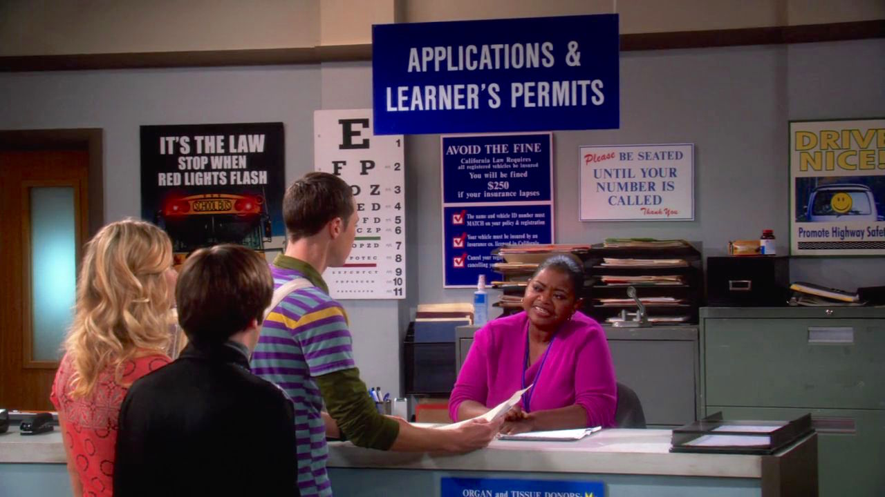

  
```{r setup, include=FALSE}
knitr::opts_chunk$set(warning = FALSE, message = FALSE, 
                      fig.retina = 3, fig.align = "center")
```

```{r xaringanExtra, echo=FALSE}
xaringanExtra::use_webcam()
```

.pull-left[
# Applying the Policy Process Theories
<figure>
  
</figure>
]

.pull-right[

</br>
</br>
</br>
**EVSS-PUBA 602: Public Policy**

**Fall 2021**

.light[Matthew Nowlin, PhD<br>
Department of Political Science<br>
College of Charleston
]

]

---

## What are the practical applications of these theories? 

<figure>
<center>
  
</figure>

---

class: middle 

> _Along with scholars, audiences for this paper may also include people actively engaged in politics involving public policy issues or undergraduate or graduate students, who through their courses and readings are learning about various theories of public policy and politics and wondering how – if at all – these theories might matter in a career outside the craft and science of academic theoreticians_ 

-Weible and Ingold 2018

---

class: title title-1

# Major Concepts We Covered

**How can these concepts be _applied?_**
--

* Multiple streams 

--
* Policy windows

--
* Periods of policy stasis, incremental change, and large change 

--
* Advocacy coalitions

--
* Belief systems 

--
* Policy narratives 

--
* How institutions (rules, norms, and shared strategies) influence policy outcomes 

---

class: center, middle 

# What else did you learn and how can those insights be applied? 

---

class: title title-1

# Influencing the Policy Process

--

* The _policy process_ is the study of change and development of policy and the related actors, events, and contexts
    * Multiple frameworks, theories, and models

--

* Learn how to draw lessons from each of these _approaches_ at the appropriate point in time and in the appropriate context. Don't focus on a single approach

---

class: title title-1

# Influencing the Policy Process

**Policy participants are**:

--
* Goal oriented with goals derived from a variety of sources including interests, beliefs and values, or collective affiliations; 

--
* Limited in their cognitive capacity to process the multitude of stimuli supplied from the environment; 

--
* Reliant upon heuristics to simplify, understand, interpret, and respond to incoming stimuli; 

--
* Affected by their emotions, such as fear and trust, in reasoning, allocating attention, and making behavioral decisions.

---

class: title title-1

# Influencing the Policy Process

**Contextual factors** 

--

* Policy subsystems

--

* Macro-system

--

* Policy change
  * Events
  * Learning
  * Negotiation and cooperation

---

class: title title-1

# Influencing the Policy Process

**Strategies**

--

**Develop deep knowledge in a policy subsystem**  
* Belief system awareness 
* Analytic knowledge 
* Local space and time knowledge
* Conditions from other subsystems 

--

**Invest in networks**

--

**Participate for extended periods of time** 

---

class: title title-1 

# For Next Time 

_Readings_:
* __Birkland__ Chap 9, _Policy Design and Policy Tools_ 
* **SKIM**: __BP__ Appendix B: Things Governments Do 
* __Birkland__ Chap 10, _Policy Implementation, Failure, and Learning_ (**pgs. 342-353**) 
* Herd and Monynihan Chap 1, _Administrative Burdens: Introduction_ 

**Draft of policy report part 3** 

**Reflection paper 11**  

---

class: title title-1 

# Policy Report Part 3 

**Policy alternatives**: _About 3 to 4 pages_ 

* Come up with **three policy alternatives** to address your problem or issue 
* Draw from other countries, states, cities, interest groups, think tanks, among others 
* Include a brief discussion of the **causal model** of each alternative 
* Include a couple of pros and cons for each alternative 
* Use the Bardach and Patashnik book, pgs 21-31 (Step Three: Construct the Alternatives) as guidance 

---

class: center, middle 

# Let's talk about your policy reports 


