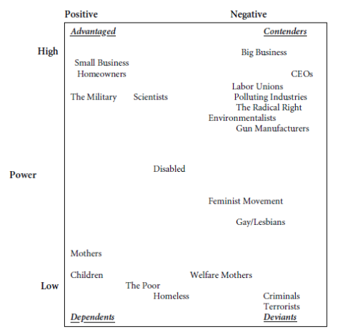

  
```{r setup, include=FALSE}
knitr::opts_chunk$set(warning = FALSE, message = FALSE, 
                      fig.retina = 3, fig.align = "center")
```

```{r xaringanExtra, echo=FALSE}
xaringanExtra::use_webcam()
```

.pull-left[
# Policy Design and Implementation
<figure>
  
</figure>
]

.pull-right[

</br>
</br>
</br>
**EVSS-PUBA 602: Public Policy**

**Fall 2021**

.light[Matthew Nowlin, PhD<br>
Department of Political Science<br>
College of Charleston
]

]

---

class: center, middle

# What do we mean by policy design?

---

class: title title-1

# Policy Design

**The process by which policies are designed, both through technical analysis and the political process, to achieve a particular goal**  

--

* Broadly speaking, the _content_ of public policy

--

* Enacted using _policy tools_

--

* Implemented: put into action 

---

class: title title-1

# Policy Problems

**Problems vs. conditions**

--

**How do we learn about conditions or problems**? 

* Changes in indicators
* Focusing events
* _Social constructions_ 

--

**Problem definitions $\rightarrow$ policy design** 

---

class: center, middle

# What are the elements of a policy design?

---

class: title title-1 

# Policy Design 

<figure>
<center>
  
</figure>

---

class: title title-1

# Causal Model 

> **A theory about what causes problem and how particular responses would alleviate the problem** 

-_Birkland_ pg 315

--
* What _causes_ outcome _Y_?   

--
* How does policy _X_ impact outcome _Y_?

--
* Causal model shapes policy tools

--
* Poor causal model can yield policy "failure"

---

class: title title-1

# Policy Tools

**A method through which government seeks an objective**

-*Lester and Salamon*

--

**Elements in policy design that cause agents or targets to do something they would not do otherwise or with the intention of modifying behavior to solve public problems or attain policy goals** 

-*Schneider and Ingram* 

---

class: title title-1 

# Policy Tools 

**Bardach and Patashnik: Appendix A - Things Governments Do** 

--

.pull-left[
* **Taxes** 
* **Regulation** 
* **Subsidies and Grants** 
* **Service Provision** 
* **Agency Budgets**
* **Information** 
* **The Structure of Private Rights** 
]

.pull-right[
* **The Framework of Economic Activity** 
* **Education and Consultation** 
* **Financing and Contracting** 
* **Bureaucratic and Political Reforms** 
]

---

class: title title-1

# Policy Tools 

**Factors in tool selection:**

--

* Technically sound design does not trump politics

--

* Tool choices are constrained by resources 

--

* Tools are based on behavioral assumptions about policy targets
  * **Targets**: entities whose behavior policy will alter
  * _Social construction of target populations_ 

---

class: title title-1

# Social Construction

**Policymakers construct _target populations_ in positive or negative terms and these terms are reflected in the distribution of benefits and burdens within the policy design** 

--

* Policymakers respond to and create social constructions

--

* Social constructions are related to _power_ and _deservingness_ 

---

class: title title-1

# Social Construction

.pull-left[

]


.right[]

---

class: center, middle

# What is policy implementation?

---

background-image: url(https://media.giphy.com/media/l0HlIfDPjYJncqTjW/giphy.gif)
background-position: 50% 50%
background-size: 70%
class: center, bottom 

---

class: title title-1

# Policy Implementation

> **The process by which policies enacted by government are put into effect by the relevant agencies** 

-*Birkland* pg 343 

--

* What happens between policy design (enactment) and policy outcomes (or outputs) 

---

class: title title-1

# Policy Implementation 

**Politics - Administration dichotomy**

--

.pull-left[
**Politics** 

* Decides what actions should be taken through debate 

* _Values based_

]

--

.pull-right[
**Administration** 

* Implements policies made by elected officials 

* _Expertise based_
]

---

class: title title-1

# Policy Implementation 

**Authority and Accountability** 

<figure>
<center>
  
</figure>

---

class: center, middle

# What is the difference between _top-down_ vs. _bottom-up_ policy implementation?

---

class: title title-1

# Policy Implementation

<figure>
<center>
  
</figure>

---

class: title title-1

# Administrative Burden 

.pull-left[
**The costs incurred when interacting with government** 

**_Any context in which the state regulates private behavior or structures how individuals seek public services is a venue in which the state may impose burdens on its citizens_**
]

.pull-right[
<figure>
<center>
  
</figure>
]

---

class: title title-1

# Administrative Burden

**Types of Costs**

--

**Learning costs** 
* Costs that people encounter when they search for information about public services

--

**Compliance costs** 
* Cost of complying with rules and requirements

---

class: title title-1

# Administrative Burden: Types of Costs

**Types of Costs**

**Psychological costs**
* Stresses, loss of autonomy, or stigma

---

class: center, middle

# Why should we care about administrative burdens?  

???
have you encountered any administrative burdens? (here at college; poli sci advising)
---

class: title title-1 

# Administrative Burden 

**The presence of administrative burdens makes the difference as to whether government is experienced as accessible or opaque, simple or bewildering, respectful or antagonistic** 

--

**Burdens are**:

* Consequential
* Distributive
* Constructed

---

class: title title-1

# Administrative Burden 

**Burdens are consequential**

--

* **The costs citizens' bear influence citizens’ perceptions of government** 
  * _Taxes_ 

--

* **Burdens matter for whether we gain access to vital resources, such as education**
  * _Free Application for Federal Student Aid (FAFSA) form_ 

---

class: title title-1

# Administrative Burden 

**Burdens are consequential**

* **Burdens can, quite literally, determine who is and is not a member of society**
  * _Immigration_ 

---

class: title title-1

# Administrative Burden 

**Burdens are distributive** 

--

_Do administrative burdens hurt some more than others?_

--

**_Those who are least advantaged tend to face more administrative burdens, even though they have fewer resources to manage and overcome them_** 

--

**_Burdens reinforce inequalities in access to rights_**

???
Vote, reproductive care, benefits  
---

class: title title-1

# Administrative Burden 

**Burdens are distributive**

--

_Redistributive policies_

--

.pull-left[
**Universal programs** 
* Near 100 percent up-take 
]

--

.pull-right[
**Means-tested programs**
.small[
* SSI: 40 to 60 percent 
* SNAP: 65 percent 
* Unemployment: 30 to 60 percent 
* Medicaid: 50 to 70 percent 
* EITC: 80 percent 
* AFDC (77 to 86 percent) vs TANF (42 to 52 percent)
]
]

???
Takes (or seems to take) a resource from one identifiable group and gives a benefit to another readily identifiable group 
---

class: title title-1

# Administrative Burden 

**Burdens are distributive** 

--

**Resources matter in overcoming burdens** 

--

* College applications
  * Providing information and waiving application fees made low-income students 46 percent more likely to apply to college 
  * Providing assistance in completing the FASFA led to a 26 percent increase  

--

**For poor Americans the experience of government is the experience of burdens** 

---

class: title title-1

# Administrative Burden 

**Burdens are constructed** 

--

* Administrative burdens are the product of administrative and political choices

--

* Political actors often see burdens as a policy tool to achieve an ideological goal


---

class: title title-1

# Administrative Burden 

**Some degree of burden is necessary to prevent fraud** 

--

**Guidelines** 

* Citizens are better off when public programs are designed to be simple, accessible, and respectful of the citizens they encounter

--

* Burdens should be minimized to the greatest extent consistent with protecting important public values, such as cost and program integrity 

---

class: title title-1

# Administrative Burden 

**Some degree of burden is necessary to prevent fraud** 

**Guidelines** 

* Considerations of burden should be evidence based, identifying the multiple values involved and the likely effects of burdens on those values, and informed by logic and empirical evidence rather than by political rhetoric **or lies** 

---

class: title title-1

# Administrative Burden 

**Some degree of burden is necessary to prevent fraud** 

**Guidelines** 

* Because burdens can affect some groups more than others, we should be especially attentive to costs on those with limited resources or in programs that are specifically to help those with limited means

---

class: title title-1

# Next Time 

**Policy Analysis and Evaluation** 

_Readings_:

* __Birkland__ Chap 8, _Decision-Making and Policy Analysis_ 
* Radin, Beryl A., Chap 6, _The Tools of the Trade_ 
* **Cairney blog post**: [Success and Failure (Evaluation)](https://paulcairney.wordpress.com/2013/12/21/policy-concepts-in-1000-words-success-and-failure-evaluation/)
* deLeon, Peter. 1992. “The Democratization of the Policy Sciences.” _Public Administration Review_ 52(2): 125–29.

---

class: title title-1

# Policy Report Part 4 Draft 

**Criteria Analysis** 

<figure>
<center>
  
</figure>


