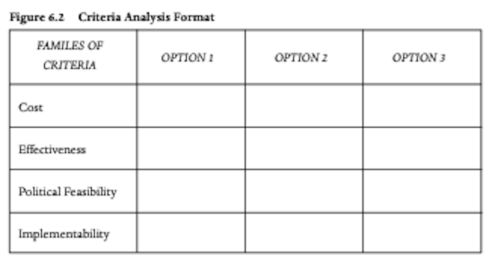

  
```{r setup, include=FALSE}
knitr::opts_chunk$set(warning = FALSE, message = FALSE, 
                      fig.retina = 3, fig.align = "center")
```

```{r xaringanExtra, echo=FALSE}
xaringanExtra::use_webcam()
```

.pull-left[
# Policy Analysis and Evaluation
<figure>
  
</figure>
]

.pull-right[

</br>
</br>
</br>
**EVSS-PUBA 602: Public Policy**

**Fall 2021**

.light[Matthew Nowlin, PhD<br>
Department of Political Science<br>
College of Charleston
]

]

---

class: center, middle 

# What is policy analysis? 

---

class: title title-1

# Policy Analysis 

> **The practice by which policy analysts use various analytic tools, often derived from fields such as operations research, statistics, and economics, to understand the likely outcomes and benefits of particular policy ideas**

-*Birkland*

--

* _ex ante_: prior to a policy decision 

--
* _What should we do_?

--
* Has become increasingly technical and sophisticated

---

class: title title-1

# Policy Analysis 

**Roles that a policy analyst might take** 

--

**Objective technician**: 
* "_Let the analysis speak for itself_"
* Politics secondary
* Objective advice promotes good policy in the long run
* _Neutral competence_ 

--

.small[**Neutral competence**: _use of appropriate methods for assessing problems and predicting the consequences of policy alternatives as well as neutrality in choosing and arguing for the social values that provide a basis for comparison_] 

---

class: title title-1

# Policy Analysis 

**Roles that a policy analyst might take** 

**Client's advocate**: 
* "_Ambiguity, so let the client decide the focus_"
* Clients provide legitimacy
* Align with compatible value systems 

---

class: title title-1

# Policy Analysis 

**Roles that a policy analyst might take** 

**Issue advocate**: 
* "_Ambiguity, so let values decide the focus_"
* Advocate for specific problems/policies
* Analysis an instrument for promotion of values 

--

**Regardless of role, analysis should always be open and transparent** 

---

class: title title-1

# Analytic Approaches

**Cost-benefit analysis** 

_Measure the costs and benefits of each possible policy and then choose the policy that generates the **maximum net benefit** to society as a whole_

--

**Efficiency**

* Maximizing net benefits
* _Best use of public dollars_ 

---

class: title title-1

# Analytic Approaches

**Cost-benefit analysis: Steps** 

1. Specify the set of alternatives

--
1. Catalog the costs and benefits and select measurement indicators

--
1. **Monetize all costs and benefits**

--
1. **Discount benefits and costs to obtain _net present values_**

--
1. Compute the net present value of each alternative

--
1. Based on net present values determine the most efficient alternative

???
costs: opportunity costs 

benefits: willingness-to-pay 

Hedontic price method 

Contingent valuation
---

class: center, middle

# How much money is a human life worth?

---

class: center, middle

# $10 million ($2016) 

---

class: title title-1

# The Value of A Statistical Life

<br>

> **Estimates of how much people are willing to pay for small reductions in their risks of dying from adverse health conditions that may be caused by environmental pollution**

-_Environmental Protection Agency_

---

class: title title-1

# The Value of A Statistical Life

**Calculation** 

* What would someone be willing to pay for a reduction in their individual risk of dying of 1 in 100,000, or 0.001%, over the next year? 

--

* One fewer death among the 100,000 is "one statistical life saved" 

--

* The average WTP is $100, so $100 x 100,000 

--

* The value of a statistical life = $10 million 

---

class: title title-1

# Analytic Approaches

**Policy Mapping** 

.pull-left[
Used to define the context, actors, and relationships surrounding a policy problem 

* Policy report part 2  
]

.pull-right[
<figure>
<center>
  
</figure>
]

---

class: title title-1

# Analytic Approaches

**Criteria Analysis** 

.pull-left[
Allows analyst to address the trade-offs of each alternative according to the specified criteria. 
* _Policy report part 4_  
* Efficiency
* Political feasibility
* Administrative capacity
]

.pull-right[
<figure>
<center>
  
</figure>
]

---

class: title title-1

# Policy Analysis Steps 

--

**Define the problem**

--

**Identify alternative courses of action**

--

**Estimate outcomes**

--

**Compare alternatives**

--

**Choose the "most preferred" alternative**

---

class: center, middle 

# What is policy evaluation?

---

class: title title-1 

# Policy (Program) Evaluation  

**Systematic assessment of the operation and/or the outcomes of a program or policy, compared to a set of explicit or implicit standards, as a means of contributing to the improvement of the program or policy** 

.small[-*Weiss*]

--
* _ex post_: after an action has been taken

--
* _What have we done_?

--
* Focus on consequences

---

class: title title-1

# Types of Policy Evaluation 

--

**Formative** 

* "_Should we change anything that we are doing_?" 
* Taken in the early stages of a policy to inform development 

--

**Summative** 

* "_Should we keep doing what we are doing, do something different, or stop doing it all together_?"
* Taken later on to decide whether to expand, contract, terminate, or continue a program

---

class: title title-1

# Types of Policy Evaluation 

**Process** 

* "_What is the policy actually doing_?"
* Oriented toward issues like compliance and auditing
* Focus on _outputs_ 

--

**Outcome** 

* "_What has the policy actually achieved_?"
* Is the policy having any impact on the problem it was designed to address?

---

class: title title-1

# Impact Analysis

**A specific form of an outcome evaluation** 

--

**Three core elements** 

* _The problem_: Social condition 

* _The activity_: The policy 

* _The outcome_: The effect of the policy on the social condition

---

class: title title-1

# Impact Analysis

**Causality: Does _X_ (the policy) cause _Y_ (the outcome)**?

--

**Causal (or program) theory** 
* What causes a problem and how it might be alleviated 
* Causal claim(s) linking tools to outcomes 

--

**Carbon tax and GHG emissions: Program theory** 

Carbon tax increases price $\rightarrow$ Consumption decreases $\rightarrow$ Emissions are reduced

---

class: title title-1 

# Impact Analysis 

**Causality: Does _X_ (the policy) cause _Y_ (the outcome)**?

- Causal (policy) effect: $\tau_X = Y_1-Y_0$ 

- $\tau_X$ : Treatment (policy) (_X_)

- $Y_1$ : Treatment is present 

- $Y_0$ : Treatment is _not_ present 

* Impact is the difference between $Y_1-Y_0$

---

class: title title-1 

# Impact Analysis: Research Designs 

**Experimental** 
* Treatment and control groups, with random assignment  

--

**Quasi-experimental**  

* No randomization; systematically construct a comparison group 

--

**Observational**  
* Use of statistical controls (e.g., OLS); Sensitivity analysis 

---

class: center, middle 

# The Democratization of policy analysis 

---

class: title title-1

# Participatory Policy Analysis 

**Technocratic vs democratic** 

--

**Democratized policy analysis** _asks that policy analysis devise and actively practice ways to recruit and include citizens' personal views into the policy formulation process_ 

--

**Policy sharing**: _access to planning and policy decisions, and an implied influence over subsequent operational decisions_ 

--
* Public opinion surveys 

--
* Citizens panels 

---

class: title title-1

# For Next Time 

**Readings**:

* **Cairney blog post**: [Evidence-based policymaking and the ‘new policy sciences’](https://paulcairney.wordpress.com/2018/10/25/evidence-based-policymaking-and-the-new-policy-sciences-2/)
* __SKIM: BP__: Parts I-IV 

**Assignment**: 
* Course reflection paper due


