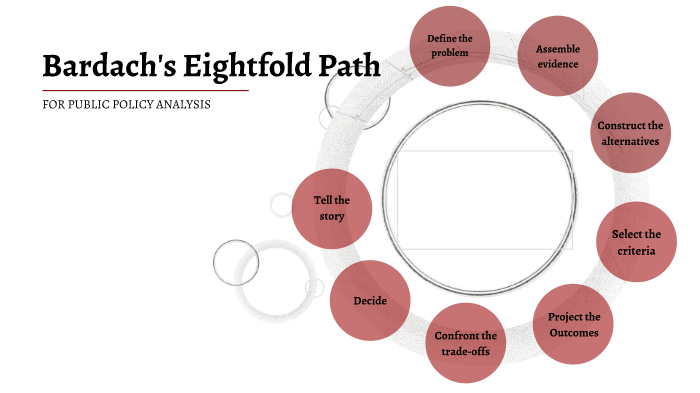

  
```{r setup, include=FALSE}
knitr::opts_chunk$set(warning = FALSE, message = FALSE, 
                      fig.retina = 3, fig.align = "center")
```

```{r xaringanExtra, echo=FALSE}
xaringanExtra::use_webcam()
```

.pull-left[
# Doing Policy Analysis
<figure>
  
</figure>
]

.pull-right[

</br>
</br>
</br>
**EVSS-PUBA 602: Public Policy**

**Fall 2021**

.light[Matthew Nowlin, PhD<br>
Department of Political Science<br>
College of Charleston
]

]

---

class: title title-1 

# Course Evaluations 

<figure>
<center>
  
</figure>

---

class: title title-1

# Doing Policy Analysis 

**Evidence-based policymaking** 

--

_Evidence-based policymaking is the process of using high-quality information to inform decisions that are made about government policies_

--

**Not how it happens** 

---

class: title title-1

# Studying Public Policy 

**Harold Laswell and the Policy Sciences** 

.pull-left[

<figure>
  
</figure>
]

.pull-right[

* Knowledge *of* the policy process
    * How policy is made 

* Knowledge *in* the policy process
    * Policy analysis 
    * Policy evaluation 
]

---

class: title title-1

# The 'New' Policy Sciences 

.pull-left[
* a return to Lasswell’s vision of combining policy analysis (to recommend policy change) and policy theory (to explain policy change), but

* focusing on a far larger collection of actors (beyond a small group at the center),
]

.pull-right[
<figure>
  
</figure>
]

???
cairney and weible
---

class: title title-1

# The 'New' Policy Sciences 

.pull-left[
* recognizing new developments in studies of the psychology of policymaker choice, and
* building into policy analysis the recognition that any policy solution is introduced in a complex policymaking environment over which no-one has control
]

.pull-right[
<figure>
  
</figure>
]

---

class: title title-1

# Doing Policy Analysis 

**Applied policy research is about going through an iterative _problem solving process_** 

<figure>
<center>
  
</figure>


---

class: title title-1

# Steps in Policy Research - Policy Report

.pull-left[
**Introduction and Problem Definition** 
* About 2 to 3 pages 

**Policy History and Mapping**
* About 3 to 4 pages
]

.pull-right[
**Policy Alternatives**
* About 3 to 4 pages 

**Recommendation**
* About 1 to 2 pages
]

**Total policy report: 10-15 PAGES**  

---

class: title title-1

# A Quick Note on Citations and Sources 

**In-text, parenthetical citations are for paraphrasing** 

**If you use the same words as the source put in quotes with a page number** 

.pull-left[
* "It is important to cite your sources properly" (Nowlin 2021, 1)
    * Beyond four lines indent a paragraph 
]

.pull-right[
* Scholars often note the need for proper citation practices (Nowlin 2021)
]

---

class: title title-1

# A Quick Note on Citations and Sources 

**Include a bibliography or work cited page with 10 sources beyond course readings**

**Use multiple sources** 
* What are some of the things that your source cites? Who has cited your source? 

**Feel free to use any citation style you prefer (APA, MPA), but be consistent** 

---

class: title title-1

# Steps in Policy Research 

**Step 1: Define the problem: _Introduction and Problem Definition_** 

_What private troubles warrant definition as public problems_? 

* Think in terms of a _market failure_ 
* Try and quantify (deficit and excess; e.g., number of homeless families)

**DO NOT: _Define the solution in the problem_** 
.small[
* e.g., the fact that marijuana is illegal
* e.g., _from the book_: there is not enough shelter for homeless families 
]

---

class: title title-1

# Steps in Policy Research 

**Step 2: Assemble some evidence: _All parts of the report_** 

* **Data**: facts about the world 

* **Information**: data that have _meaning_ 

* **Evidence**: information that affects existing beliefs 

**Review the available literature** 

**Survey "best practices"** 

* What are other counties, states, countries doing?

???
"extraordinary claims require extraordinary evidence" -Christopher Hitchens 
---

class: title title-1

# Steps in Policy Research 

**Step 3: Construct the alternatives: _Policy Alternatives_** 

* "Policy options", "alternative courses of action" 
* Look to "best practices" 
* Look to BP: _Appendix A: Things Governments Do_ 
* **Describe the _causal model_** 
* Describe some pro and cons of each alternative 

**Create a sub-section title for each alternative** 
* **Alternative 1: Rent control** 

???
what is a causal model? from Birkland and policy design - what is it about policy X that would _cause_ outcome Y? 
---

class: title title-1

# Steps in Policy Research 

**Step 4: Select the criteria: _Policy Alternatives_** 

**This has been done for you**

* **Efficiency**: maximize social welfare. Best use of public funds

* **Political feasibility**: how politically acceptable is the alternative? How much support? How much opposition? 

* **Administrative capacity to implement (administrative robustness and improvability)**: how capable are current administrative and bureaucratic systems to successfully implement each alternative? 

---

class: title title-1

# Steps in Policy Research 

**Step 5: Project the outcomes: _Policy Alternatives_**

* Create your best guess, most realistic expectations about how each alternative will impact the problem

  * _Include this in your description of the policy alternative_ 

---

class: title title-1

# Steps in Policy Research 

**Step 6: Confront the Trade-offs: _Policy Alternatives_**

* Discuss the trade-offs associated with the expected outcome for each alternative 

**Criteria Analysis from the Radin reading** 

* Create a table with the policy alternatives as the columns, the criteria (efficiency, political feasibility, and administrative capacity) as the rows, and put high, medium, or low in the cells. 

* Briefly explain your reasoning in the the text

---

class: title title-1

# Steps in Policy Research 

**Step 7: Decide: _Recommendation_** 

* Which alternative is "best" based on the criteria and expected outcomes? 

**Step 8: Tell your story: all parts of the report** 

* Know your audience 
* The Grandma Bessie Test  
* Create a logical narrative flow 

---

class: title title-1

# Decision Memo 

**A short and concise document that summarizes your policy report** 

**About 1 to 2 pages, single spaced with no references** 

--

**Heading** 

TO: _Decision maker that is the intended audience_ 

FROM: _Your Name_

SUBJECT: _Policy issue you are addressing_ 

DATE: _Due date of the assignment_

---

class: title title-1

# Decision Memo 

**Parts of the memo** 

* Executive summary 

* Background 

* Alternatives 

* Recommendation

---

class: center, middle 

# Final report and decision memo due in the Assignment folders on OAKS on Friday, December 10 by 11:59 PM  

---

class: center, middle

# Thanks for a great semester!


